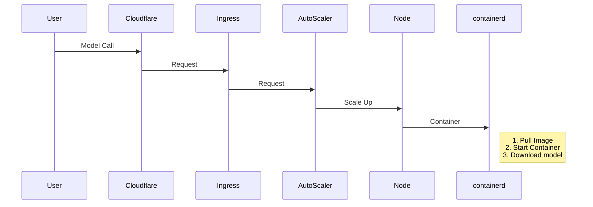
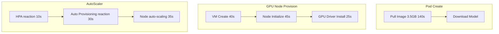

# Optimizing Model Inference Cold Start

Previously, while working on Serverless model inference [Modelz](https://modelz.ai/), although we have pivoted now, I still want to share how to optimize the cold start problem of model inference. Since our service is based on container orchestration, it also involves the cold start problem of containers.

# Optimizing Model Inference Cold Start 

## Problem

First, let's look at the process of Serverless model inference, from user request to model inference:

The entire process chain is very long, but the real time-consuming part is the process of pulling the image and starting the container by Containerd at the end. We further break down this part, and the time for each stage here is roughly from reference 1:

If it is a 30G image (not uncommon in AI inference scenarios), the pull time will exceed 15 minutes, which is unacceptable for users.

The model download depends on the size of the model and whether the model already exists in the Pod. This time is also uncontrollable, but we will propose targeted optimization solutions later.

## Deep Dive

### Why is the image so large?

  

  

From the above two images, we can see that
1. Except for the NVIDIA Kernel Driver and CUDA Lib placed on the Host, the libraries that AI applications and frameworks depend on are all placed in the image.
2. NVIDIA's strategy prevents you from significantly reducing your image size. You don't know which libraries will be used, so you have to put all the libraries in the image.

## Solutions we have tried

### 1. Preheating

First, we use [cluster-proportional-autoscaler](https://github.com/kubernetes-sigs/cluster-proportional-autoscaler) to scale the GPU resources to 2 nodes when the total number of nodes is 8, even if there are no requests, there is a reserved bubble. Then, according to the frequency of image usage, we use [kube-fledged](https://github.com/senthilrch/kube-fledged) to create an ImageCache on these nodes, so that when the actual request comes, the image is already on the node.

### 2. Cache Model

We developed a HuggingFace model caching service. This service compares the hash value of the model when the model is called. If the model already exists in the caching service, it directly returns the cached model; otherwise, it downloads the model to the caching service.

### 3. GCP Image Streaming

Use [GCP Image Streaming](https://cloud.google.com/blog/products/containers-kubernetes/introducing-container-image-streaming-in-gke) to convert self-managed images or user-defined images to GCP's Artifact Registry. When the node pulls the image, it mounts the container layers to the node through the network, making containerd think the image is already on the node. However, this solution has several drawbacks:
1. Requires GCP support, vendor lock-in
2. User images need to be proxy converted to GCP, which will have some delay
3. Although the pod is running, it is not fully operational, which may cause slow runtime

### 4. Change Image Format

Convert the OCI image format to [nydus](https://github.com/dragonflyoss/nydus) format and combine it with lazy pulling technology [zran](https://github.com/dragonflyoss/nydus/blob/master/docs/nydus-zran.md). Testing shows several times improvement. However, it requires modifying containerd configuration to support nydus. Combined with [Dragonfly](https://github.com/dragonflyoss/dragonfly) P2P technology, the image pull speed can be further improved.

### 5. Use JuiceFS to Build Model Cache Cluster

By building an independent cache pool, cache the model to JuiceFS. Mount the cache directory to the container through JuiceFS CSI. If the model already exists in JuiceFS, use it directly; if not, download and cache it directly to JuiceFS. This architecture mainly utilizes JuiceFS Posix and the advantages of using object storage, without worrying about cache size. Here, JuiceFS parameters need to be tuned, such as prefetch block, buffer size, etc.

## Possible Future Optimizations
- Use GCP's [image preloading](data-container-image-preloading) feature to preload images to the node through secondary boot disks.
- In-class registry cache [spegel](https://github.com/spegel-org/spegel).
- Parallel Downloading in Kubelet [KEP 3673](https://github.com/kubernetes/enhancements/blob/master/keps/sig-node/-kubelet-parallel-image-pull-limit/README.md).
- [Parallel Container Layer Unpacking](https://github.com/containerd/containerd/issues/8881), mentioned in reference 1, containerd needs to implement high IO queue depth to fully utilize EBS throughput.
- [yetone's solution](https://x.com/yetone/status/1858034646585368891): 
    > parsed the Dockerfile, then obtained the base image and a series of args, env, and commands, and merged them in order to hash as the s3 object key. Then, in the image builder job's pod container, started dind, then started a new container with the base image inside, executed the parsed commands, and after completion, tarred the container's rootfs, compressed it with zstd, and uploaded it to s3.
    
    > OCI image builder and containerd remote snapshotter, on the builder side, build the image and split all layers into two layers: environment (very large) and code (very small). Then use pzstd and s5cmd for streaming compression and streaming upload to s3. On the snapshotter side, use s5cmd and pzstd for streaming download and streaming decompression, fully utilizing GKE's disk IO, improving image pull speed by about 4 times.
- Modal lazy container loading
    > 
- Do some research on [ServerlessLLM OSDI24](https://www.usenix.org/system/files/osdi24-fu.pdf)

## References
1. https://www.youtube.com/watch?v=e6Oo2aoZPnA
2. https://www.youtube.com/watch?v=SlkEW4C2kd4

