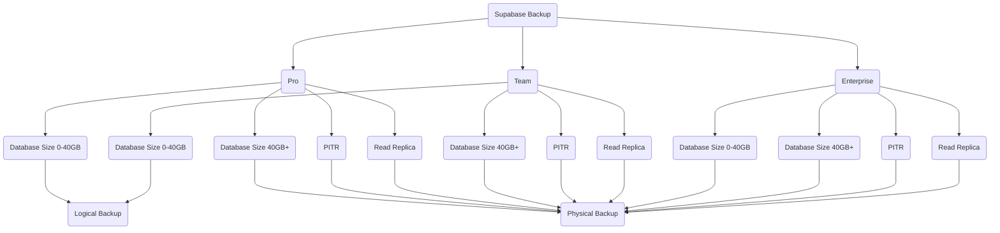
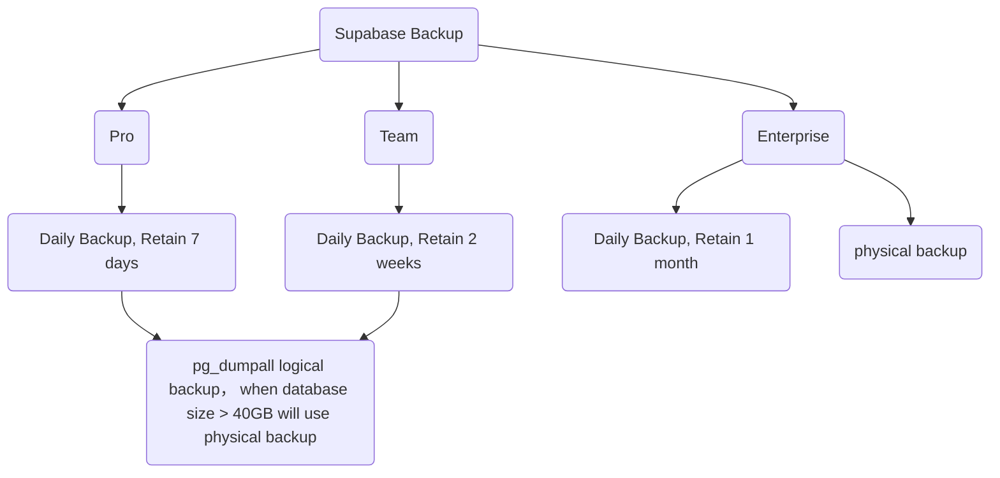
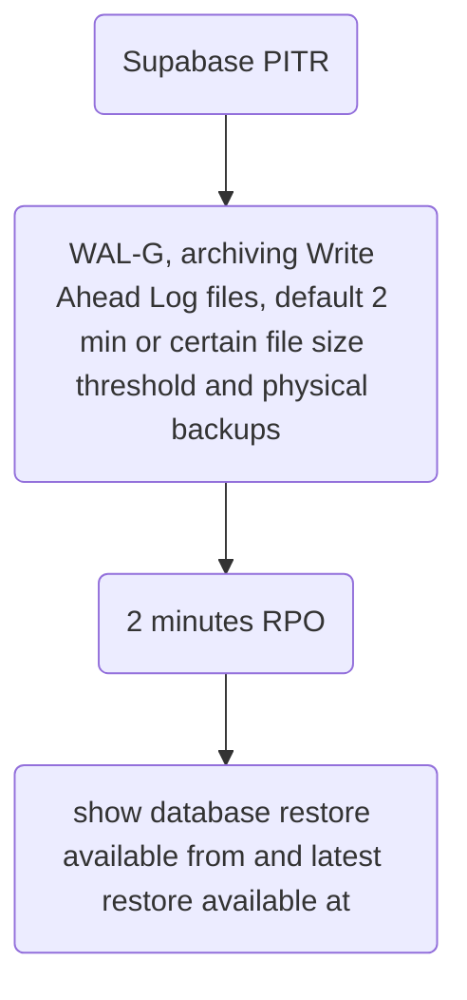
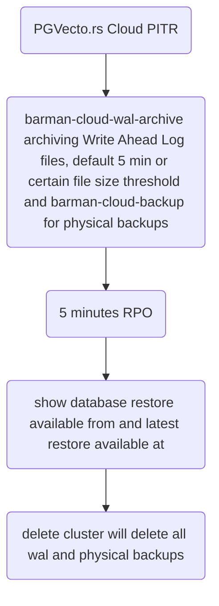

# PostgreSQL High Availability

I've been researching PostgreSQL high availability solutions recently, and here's what I've learned.

# PostgreSQL High Availability

## High Availability Goals

PostgreSQL high availability typically has two main objectives:
1. RPO (Recovery Point Objective): The maximum acceptable amount of data loss measured in time. This represents how much data loss a business can tolerate.
2. RTO (Recovery Time Objective): The maximum acceptable downtime, measured from when a disaster occurs until the system is operational again. This represents how quickly the system needs to be restored.
In simple terms, this means determining how quickly to restore the database and to what state - for example, recovering within 5 minutes to a state no more than 30 minutes old. The ideal scenario would be RTO < 30s and RPO ≈ 0.

## Scenarios

To achieve the ideal scenario mentioned above, the following situations need to be addressed:
1. When the Primary node fails, automatic failover to the Standby node occurs within RTO requirements while meeting RPO goals.
2. When accidental data deletion occurs, upgrade errors happen, or hardware failures occur, the ability to recover to a specific point in time.

## Concepts

To handle these scenarios, the following technologies and concepts are essential:
1. Continuous Archiving: Generally involves archiving WAL (Write Ahead Log) files; in case of database system crashes, recovery can be performed by replaying WAL.
2. Point-in-Time Recovery (PITR): For hardware failures, high availability failover based on physical replication might be the best choice. For data corruption (whether machine or human error), Point-in-Time Recovery (PITR) is more appropriate as it provides a safety net for worst-case scenarios.
3. Physical Replication: Complete replication of data files and transaction log files (PGData, pg_wals)
4. Logical Replication: Replication between publisher and subscriber based on replication identifiers (e.g., primary keys), typically used for Foreign Data Wrapper (FDW) scenarios rather than disaster recovery.
5. [Streaming Replication](https://wiki.postgresql.org/wiki/Streaming_Replication): WAL log-based streaming replication, primarily used for disaster recovery. WAL XLOG records are continuously transmitted from primary to standby, available in both synchronous and asynchronous modes.

## Tools

### Backup and Restore

Here are the common backup and recovery methods along with their pros and cons:

#### 1. Pg_dump (Logical Backup)

Logical backup exports database data to a file using the `pg_dump` SQL command, which can then be imported back using SQL commands.
Advantages:
1. Logical backups can be performed at table to database level as needed
2. Backups don't block read/write activities on the database
3. Can be restored to different major PostgreSQL versions and even different operating system architectures
Disadvantages:
1. Logical backups require replay during recovery, which can take considerable time for large datasets and may impact overall performance
2. Doesn't support dumping global variables, requires pg_dumpall instead

#### 2. Physical Backup

Physical backup is an offline backup of the PostgreSQL cluster performed when the cluster is stopped, containing the entire cluster data.
Advantages:
1. Fast backup and recovery
2. Suitable for large databases
3. Ideal for high availability scenarios
Disadvantages:
1. Cannot restore across different versions
2. Cannot restore across different operating systems

#### 3. Continuous Archiving and Point-in-Time Recovery (PITR)

Online Backup or Hot Backup starts with a full backup that can be performed online without stopping the PostgreSQL cluster. Incremental backups generate WAL logs, which can then be used for recovery through WAL archive replay.
Advantages:
1. Can recover to any point in time
2. No application downtime required
Disadvantages:
1. May require significant time to recover data from archives, primarily used for massive databases that cannot be backed up frequently

#### 4. Snapshots and Cloud Backups
Snapshots require operating system or cloud provider support, with tools like rsync available for taking snapshots.
Disadvantages:
1. Not suitable when database tablespaces are stored across multiple drive volumes

Several considerations go into backup planning, including frequency, storage location, recovery time, and retention policies. Here are some popular open-source tools to assist with backups:
- [pgbackrest](https://pgbackrest.org/)
- [EDB barman](https://github.com/EnterpriseDB/barman)
- [WAL-G](https://github.com/wal-g/wal-g)
From this [discussion](https://github.com/cloudnative-pg/cloudnative-pg/discussions/3145#discussioncomment-7394174), barman lacks some features compared to pgbackrest:
1. Zstd compression
2. Delta restore
3. Encryption at rest
4. Native postgres page checksum validation
5. Multi repo

### High Availability

- [Patroni](https://github.com/patroni/patroni)

Patroni uses asynchronous Streaming Replication by default, meaning transactions committed on the primary node may take some time to replicate to standby nodes. During this time, if the primary node fails, data from this period could be lost. Synchronous replication can be used to reduce data loss, but this affects primary node performance as it must wait for all standby nodes to receive and write WAL logs before committing transactions. A balance between availability and performance must be struck.

Patroni's maximum_lag_on_failover and PostgreSQL's wal_segsize need to be balanced between availability and durability:
1. `maximum_lag_on_failover` defaults to 1MB (1048576 bytes), meaning if a node lags beyond this value, it won't be chosen as the new primary. This typically works in conjunction with `loop_wait` and `ttl` parameters. For example, with a ttl of 30, if a Patroni node fails to renew with Etcd or Consul within 30 seconds, it loses leadership. With loop_wait set to 10 seconds, Patroni performs its main operation loop every 10 seconds, including status checks and necessary operations. Worst-case data loss: maximum_lag_on_failover bytes + logs written in the last TTL seconds. Reducing this value lowers the upper limit of data loss during failover but increases the chance of automatic failover being rejected due to unhealthy replicas (too far behind).
2. `wal_segsize` parameter defines the size of each WAL log segment file, defaulting to 16MB

## Architecture

There are many PostgreSQL high availability architectures available. Here are two common architectures, corresponding to self-hosted PostgreSQL and cloud-hosted PostgreSQL typical architectures:
- [Pigsty](https://pigsty.io/zh/docs/concept/ha/)
- [Cloudnative-PG HA](https://cloudnative-pg.io/documentation/1.23/architecture/)

### Pigsty HA Architecture

The following diagram is from pigsty:

From top to bottom:
1. Application layer resolves DNS to vip-manager's VIP, vip-manager gets the current primary's IP address through etcd, then binds the L2 VIP to the primary node; HAProxy handles L5 layer port forwarding.
    - Patroni: Synchronizes primary node information to etcd.
    - [vip-manager](https://github.com/cybertec-postgresql/vip-manager): Virtual IP and state managed synchronously by etcd.
    - HAProxy: Routes based on ports
        - 5433: Connects to PGBouncer pool for primary read/write
        - 5434: Connects to PGBouncer pool for replica read-only
        - 5436: Direct connection to primary for management
        - 5438: Direct connection to replica for management, connects to dedicated replicas not handling online read traffic, used for ETL and analytical queries.
2. Primary and replica synchronize WAL logs through Streaming Replication, primary sends WAL logs to replica via pg_receivexlog, replica replays WAL logs via pg_replay.
3. Patroni performs backups through pgBackRest, backup data can be stored locally, in remote s3 or minio storage, refer to the [documentation](https://pgstef.github.io/2022/07/12/patroni_and_pgbackrest_combined.html).
> - PostgreSQL uses standard streaming replication to set up physical replicas, with replicas taking over when the primary fails.
> - Patroni manages PostgreSQL server processes and handles high availability matters.
> - Etcd provides distributed configuration storage (DCS) capability and is used for leader election after failures
> - Patroni relies on Etcd to reach cluster leader consensus and provides health check interfaces.
> - HAProxy exposes cluster services and automatically distributes traffic to healthy nodes using Patroni health check interfaces.
> - vip-manager provides an optional layer 2 VIP, gets leader information from Etcd, and binds the VIP to the node hosting the cluster's primary.
With primary-replica architecture + automatic failover + synchronous streaming replication + pgBackRest backup, RTO is within 1 minute and RPO is 0, meaning recovery within 1 minute with no data loss.

### Cloudnative-PG HA Architecture

Based on Kubernetes container orchestration characteristics, Cloudnative-PG HA architecture adopts a more modern approach:
- Multi-region Kubernetes deployment
- PostgreSQL nodes deployed across multiple availability zones (three or more)
- Primary-Standby using synchronous or asynchronous Streaming Replication
- PostgreSQL instances don't share resources, have dedicated node resources, run on different Kubernetes worker nodes, use local volumes
- Application layer provides `rw`, `ro`, `r` services for connecting to primary node, hot standby replicas for read-only workloads, and any read-only workloads respectively; during failover, it automatically updates services to point to the promoted service, ensuring seamless traffic redirection from applications.
- Provides Pooler object to create PGBouncer connection pools for connecting to primary and read-only nodes
- Deploys PostgreSQL across multiple Kubernetes clusters through Replica Cluster
    - Reduces global Recovery Point Objective (RPO) by storing PostgreSQL backup data across multiple locations, regions, and potentially different providers (disaster recovery)
    - Reduces global Recovery Time Objective (RTO) by leveraging PostgreSQL replication outside the primary Kubernetes cluster (high availability)
    - Designated primary cluster can be promoted at any time, making the replica cluster the primary cluster accepting write connections.
- WAL archiving through s3
- Backups through barman, can backup to cloud object storage like s3 or use Volume Snapshot

Under this architecture, cross-region disaster recovery provides approximately 5 minutes RPO at most, with synchronous Streaming Replication achieving 0 RPO and extremely low RTO.

### Supabase Backup

Users can access the daily generated logical backup SQL files for restore.

## References
- https://pigsty.io/
- https://cloudnative-pg.io/
- https://www.cnblogs.com/xianghuaqiang/p/14792001.html
- https://docs.pgbarman.org/release/3.10.1/
- https://github.com/cloudnative-pg/cloudnative-pg/discussions/3145
- https://supabase.com/blog/postgresql-physical-logical-backups
