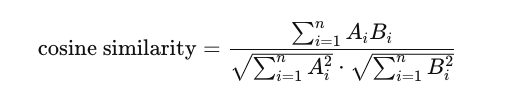

# The internals of Vector Databases


It has been over a year since I joined [Tensorchord](https://tensorchord.ai), and I haven't had the time to sit down and write some articles. Mainly because after having my daughter Tongtong, things have become much busier. During this time, I also experienced the pivot of the business from Serverless model inference [Modelz](https://modelz.ai/) to the vector search field [VectorChord](https://vectorchord.ai/). The experience of this pivot might be shared in future articles, and those interested can also directly [contact](../../about/index.zh-cn.md) me. Recently, I have been developing [VectorChord Cloud](https://cloud.vectorchord.ai/), so I am summarizing the ins and outs of vector databases while learning.

## 1. What is a Vector

The meaning of vectors in physics, mathematics, and computer science is different. Here, vectors mainly refer to vectors in computer science, which are an ordered set of numerical values. In computer science, vectors are usually used to represent data. For example, in machine learning, we usually convert an image into a vector or tokenize a piece of text and then convert it into a vector for training. In vector databases, we usually convert an image, a piece of text, or an audio segment into a vector through an embedding model and then store and retrieve it. Below is a simple example where we convert a piece of text into a vector using the `all-MiniLM-L6-v2` model. `all-MiniLM-L6-v2` maps sentences and paragraphs to a 384-dimensional dense vector and can be used for tasks such as clustering or semantic search.

```python
from sentence_transformers import SentenceTransformer

model = SentenceTransformer('all-MiniLM-L6-v2')

sentences = [
    "Hugging Face is creating a tool that democratizes AI.",
    "I love natural language processing.",
    "Transformers are state-of-the-art models for NLP tasks."
]

# generate embeddings
embeddings = model.encode(sentences)

# print the embeddings
for sentence, embedding in zip(sentences, embeddings):
    print(f"Sentence: {sentence}")
    print(f"Embedding: {embedding}\n")
```

In summary, vectors are actually the bridge between real-world entities and the computer world. Computers understand and process real-world data through vectors.

## 2. What is a Vector Database

The world originally did not have vector databases, but with more vectors, vector databases emerged, just kidding hh. Here I give a simple definition: a database that can index and store vectors to achieve fast retrieval and similarity search functions. Many people on the internet define vector databases as databases that focus on processing vector data, which is not accurate. To be precise, vectors and vector search are a new data type and query processing method, which is not fundamentally different from similar and indexing methods in traditional databases.

## 3. What is Vector Search

Vector search, also known as vector retrieval, is a technique in Information Retrieval used to find the most similar vectors to a given query vector in a high-dimensional vector space. To measure the similarity between two vectors, we usually use cosine similarity, Euclidean distance, Manhattan distance, etc. To speed up vector search, we usually use index structures such as KD-Tree, IVF (Inverted File Index), HNSW (Hierarchical Navigable Small World), etc. Vector search has applications in many fields, such as in recommendation systems, where we can use vector search to find products most similar to a user's historical behavior and then recommend them to the user; in image retrieval, we can use vector search to find images most similar to a given image; in RAG (Retrieval Augmented Generation), we can use vector search to find text most similar to a given question, enhancing the Context of large models to improve the quality of generated answers.

### 3.1 Vector Search Application Scenarios

#### 3.1.1 Recommendation System

As in the On-premise case of Qdrant about [Video Content-based Recommendation](https://qdrant.tech/blog/vector-search-vector-recommendation/), the multilingual universal sentence encoder is used to embed the script when uploading a video. Here, it is not simply extracting frames from the video, but more information comes from the video title, description, automatically detected tags, and content recognized by Whisper speech recognition. So the current problem is that if the video has no audio, the title and description are forced to be used for recommendation, which is a big challenge for the review team. Here, the call start issues in the recommendation field are mentioned, that is, when users first start using the system, the recommendation quality of the recommendation system is not high, and the user experience is poor at this time. On the basis of non-real-time updated collaborative recommenders and metadata recommenders, adding a content-based recommender can greatly optimize call start issues.

#### 3.1.2  Image Retrieval

[immich](https://github.com/immich-app/immich) is a high-performance open-source self-hosted image and video management solution. Imagine when you upload all your videos and images to immich, it is difficult to find the image or video you want in a short time. At this time, an efficient image retrieval system [smart search](https://immich.app/docs/features/smart-search) is needed. Through vector search technology, you can quickly and accurately find the image or video you want through text descriptions and additional filters (tags, dates, etc.).

<div align="center">
  
</div>

<div align="center">
  
</div>

> Images from [immich](https://immich.app/docs/features/smart-search)

#### 3.1.3 RAG

RAG (Retrieval Augmented Generation) mainly solves several problems in LLM applications:
1. The data used to train LLM models is not real-time, in other words, it is static data, and the cost of obtaining the latest data and retraining is too high.
2. LLM lacks domain-specific knowledge because the training corpus of LLM is mostly general datasets on the internet. In fields such as finance, healthcare, and law, private data may be the most important, and the lack of domain data will cause LLM to hallucinate.
3. The black box problem of LLM, we cannot know how LLM generates answers, and where the source of the answers comes from.

Here, I borrow two diagrams from Paul lusztin and Aurimas Griciunas to explain how RAG works:


1. Obtain streaming real-time data of financial news and historical data.
2. Chunk the data into inputs for the embedding model, and then store the embeddings in the vector database.
3. User asks a question.
4. Find the most similar news chunks through vector search, and then perform Prompt composition with the user's historical chat information and news chunks.
5. Input into the LLM to generate an answer.
6. Return the answer to the user.
7. Store the new chat information in the user's historical data.


1. Private data, such as Notion, Jira, local PDF files, etc., are chunked into inputs for the embedding model.
2. Input the chunks into the embedding model, and then store the embeddings in the vector database.
3. The Vector Database builds an Index.
4. User asks a question, input into the embedding model.
5. The embedding model outputs the query's embedding vector.
6. Use the vector from step 5 as the Query vector and input it into the vector database.
7. The vector database finds the most similar chunks through ANNs (Approximate Nearest Neighbors Search).
8. Construct a Prompt with the searched chunks and the query.
9. Input into the LLM to generate an answer.

### 3.2 Similarity Metrics

Cosine similarity is a method used to measure the similarity between two vectors. It is measured by calculating the angle between two vectors. The range of cosine similarity is [-1, 1], where 1 means the angle between two vectors is 0 degrees, indicating that the two vectors are identical; -1 means the angle between two vectors is 180 degrees, indicating that the two vectors are completely opposite; 0 means the angle between two vectors is 90 degrees, indicating that there is no similarity between the two vectors. The calculation formula is as follows:

<div align="center">
  
</div>

This formula calculates the cosine value of the angle between vectors 𝐴 and 𝐵.

Euclidean distance is a method used to measure the similarity between two vectors. It is measured by calculating the distance between two vectors. The range of Euclidean distance is [0, ∞], where 0 means the two vectors are identical, and the larger the value, the greater the difference between the two vectors. The calculation formula is as follows:
<div align="center">
  
</div>

This formula calculates the Euclidean distance between vectors 𝐴 and 𝐵. Some do not take the square root, which only changes the numerical value but does not fundamentally differ.

Negative inner product is measured by calculating the inner product between two vectors. The larger the value, the higher the similarity between the two vectors. The calculation formula is as follows:

<div align="center">
  
</div>

Manhattan distance (taxicab distance) is measured by calculating the distance between two vectors. The range of Manhattan distance is [0, ∞], where 0 means the two vectors are identical, and the larger the value, the greater the difference between the two vectors. The calculation formula is as follows:

<div align="center">
  
</div>

### 3.3 Vector Search Algorithms

Intuitively, we can find the vector most similar to a given query vector by traversing all vectors, but the time complexity of this method is O(n), which is not feasible when the number of vectors is large. To speed up vector search, we usually use index structures such as IVF (Inverted File Index), HNSW (Hierarchical Navigable Small World), etc. Through ANNs (Approximate Nearest Neighbors Search) algorithms, we can find the vector most similar to a given query vector with lower time complexity, such as O(log(n)).

3.3.1 #### LSH (Locality Sensitive Hashing)

Locality Sensitive Hashing (LSH) works by processing each vector with a hash function, grouping vectors into buckets, thereby maximizing hash collisions, rather than minimizing collisions as usual hash functions do.

Here is a diagram from Pinecone:


The specific details of LSH are as follows:


1. Shingling: Use k-shingling and one-hot encoding to convert text into sparse vectors.
    - k-shingling means using a sliding window of size k to extract k consecutive characters from the text.
    - one-hot encoding means comparing the result of k-shingling with the vocabulary, and if it exists, it is represented as 1 in the vocabulary, otherwise 0.


2. Then use MinHash to create a "signature".
    - Create a random permutation of [1...len(voc)+1].
    - Use the value from top to bottom in the random permutation as the index. If the index-1 position of the original sparse vector is 1, take the index-1 position number of the random permutation as the signature value.
    - Repeat n times to get an n-dimensional dense vector.

3. Band and Hash 
    - Divide the n-dimensional signature vector into b groups, each with r elements.
    - Hash each group to get b hash values.
    - If two vectors have the same hash value, put them in the same bucket.
    - If in the same bucket, consider them as candidate pairs.

<div align="center">
  
</div>

Here, as b increases, more candidate pairs are returned, which naturally leads to more false positives.

<div align="center">
  
</div>

This means that as the dimension increases, the possibility of false positives increases, and more hash buckets need to be maintained, which also increases storage overhead. Therefore, LSH is more suitable for low-dimensional vector search and is not the mainstream vector search algorithm.

#### 3.3.2 IVF（Inverted File Index）

The inverted index algorithm is a simple, easy-to-understand, and very easy-to-implement algorithm, and it has a good search speed, but the search accuracy is worse than HNSW, but the memory consumption is relatively less than HNSW.

The core of building an IVF index is divided into two steps:
1. Use a clustering algorithm to divide the vectors into nlist clusters.
2. Assign the vectors to the corresponding clusters.

When searching, set the number of cells to search nprobe.
<div align="center">
  
</div>

The impact of the parameters here is:
- Increasing nlist will slow down the index building speed because the vectors need to be calculated with more centroids during the clustering process; at the same time, it will reduce the search time because there are fewer vectors corresponding to the centroids, making knn faster.
- Increasing nprobe will improve the recall rate but will reduce the search speed because more cells need to be searched.

<div align="center">
  
</div>

#### 3.3.3 HNSW (Hierarchical Navigable Small World)

HNSW combines the advantages of NSW and Skip List and is an efficient vector search algorithm. The core idea of HNSW is to build a multi-layer graph, where each layer is a small world. By searching for the nearest nodes in each layer and then searching for the nearest nodes in the next layer, the vector most similar to the given query vector is finally found.

NSW is based on a theory that the distance from any point to any other point on NSW is finite and can be found with a few jumps.

The construction process of NSW:
1. Randomly select a point as the insertion point.
2. Find the m nearest points to the insertion point.
3. Connect the insertion point with the m points.

The randomness here will increase the number of long connections in the early graph, speeding up the search, which can be understood as "highways". The red lines in the figure below are long connections:


The search process of NSW is as follows, here I borrow a diagram from Zhihu user "工牌厂程序猿":
<div align="center">
  
</div>

1. Initialize three sets, namely visited, candidate, result (fixed length); randomly select the initial point to enter and add it to the visited and candidate sets, candidate saves the distance to the query point.
2. Find the n nearest neighbors of the initial point, add them to the visited set, note that if the friend point is in the visited set, it is discarded, calculate the distance to the query point for the n nearest neighbors in parallel, sort them in ascending order (from near to far) and add them to the candidate set.
3. Find the n nearest neighbors of the candidate set, add them to the visited set, if they are already in the visited set, discard them; here query point C, only point D is not visited, because the distance from point D to the query point is less than the distance from point C to the query point, so replace point C with point D in the result set, and replace point C with point D in the candidate set.
4. Repeat step 3, find the n nearest neighbors of D, add them to the visited set, if they are already in the visited set, discard them; here query points E and G, because the distance from point E to the query point is less than the maximum distance in the result set, replace point H with point E in the result set, and remove point E from the candidate set.
5. Repeat step 3, the distance from the point with the smallest distance to the query in the candidate set H is greater than the distance from the point with the largest distance to the query in the result set E, then stop the query.

Skip List is an efficient data structure that can find the vector most similar to a given query vector in O(log(n)) time complexity. The core idea of Skip List is to build a multi-layer linked list, where each layer is an ordered linked list. By searching for the nearest nodes in each layer and then searching for the nearest nodes in the next layer, the vector most similar to the given query vector is finally found.
<div align="center">
  
</div>

Here are a few points to note about HNSW:
1. Note that the maximum number of connections per layer Max needs to be controlled. When randomly inserting nodes (the lower the layer, the greater the probability), if the number of connections of neighbor node N is greater than Max, perform a KNN search on N and re-establish connections with new neighbors.
2. Heuristic edge selection strategy: When searching for the M nearest nodes to the insertion point in each layer, it first recalls efConstruction nodes and then selects M nodes (efConstruction >= M). The process of selecting M can directly select Top-M, but it may reduce the overall connectivity. The article by "工牌厂程序猿" specifically lists this case:
<div align="center">
  
</div>

Here, efConstruction is 4, M is 2. If Top-M is directly selected, A and B will definitely be selected, which reduces the connectivity between ABQ and CD. Here, after selecting A, when looking for the second nearest neighbor, check the distance between QA and AB. If QA > AB, then look for the next nearest neighbor until it is greater than QA. Here, point C is found when AC > AQ.
3. High degree vertex is closer to the top layer, which can reduce the search path and improve search efficiency.

Construction parameters:
- efConstruction: A parameter in the graph construction process, used to control the number of nearest neighbor candidate nodes considered when establishing connections for each node. This parameter specifically affects the quality of the connections between nodes during the graph construction process. A higher efConstruction value means that more candidate nodes are considered when selecting neighbors for a node, resulting in a higher quality graph structure. However, a higher efConstruction value will increase the time and space complexity of building the graph, and it will also increase the search time.
- m: The maximum number of neighbors added per vertex, divided into m_0=2m and m_max=m, see [code](https://github.com/facebookresearch/faiss/blob/main/faiss/impl/HNSW.cpp#L76).

Search parameters:
- efSearch: Used to control the quality of the search. A higher efSearch value means that more candidate nodes are considered during the search, thereby improving the quality of the search. However, a higher efSearch value will increase the search time.

HNSW is fully in-memory because the retrieval process involves an average of hundreds of disk read operations per query, and constantly looking for the next random point will cause extremely high latency on SSD.

#### NSG (Navigating Spreading-out Graph)

NSG optimizes graph connectivity, reduces average out-degree, shortens search paths, and reduces graph size, proposing a new graph structure called Monotonic Relative Neighborhood Graph (MRNG).

The specific process is as follows:
- Build a K-nearest-neighbor-graph (KNNG) as the basis for graph construction.
- Randomly select a point as the Navigation Point, and all newly inserted nodes will add the Navigation Point to the candidate set when selecting edges.
- During the graph construction process, subgraphs will gradually be connected to the Navigation Point, so other nodes only need to maintain a few edges, thereby reducing the size of the graph.
- Each search starts from the Navigation Point and can point to specific subgraphs, reducing invalid searches and achieving better search performance.

NSG's edge selection is different from HNSW's minimum edge selection strategy. Taking point r as an example, when r is connected to p, circles are drawn with r and p as the center and the distance between r and p as the radius. If there are no other points connected to p within the intersection of the two circles, then r is connected to p. When connecting point s, since there is already point r connected to p within the intersection circle of s and p, s is not connected to p. Point t is retained because point s has been excluded. In the figure below, only points r, t, and q are connected to point p, reducing redundant edges and average out-degree.


#### 3.3.4 DiskANN

The DiskANN series consists of three articles: DiskANN, FreshDiskANN, and FilterDiskANN, which are essentially optimizations of the HNSW or NSG algorithm.

DiskANN introduces an SSD-friendly graph algorithm called Vamana, minimizing disk operations. The Vamana graph is similar to HNSW and NSG graphs, with the difference being the initial graph selection and the introduction of a loose parameter alpha during graph pruning to balance graph diameter and node connectivity, improving graph quality. Additionally, to avoid multiple random disk reads and writes, DiskANN combines two types of algorithms: clustering compression algorithms and graph structure algorithms. First, by compressing the original data, only the compressed codebook information and centroid mapping information are kept in memory, while the original data and the constructed graph structure data are stored on disk, only reading from disk when specific nodes are matched during queries. Second, by modifying the arrangement of vector data and graph structures, data points and their neighbor nodes are stored together, allowing a single disk operation to read the vector data and neighbor node information of a node.

Graph construction process:
1. First, build a random graph. Unlike NSG's K-nearest-neighbor graph, each node is randomly connected to R nodes.
2. Calculate the starting point, finding the point closest to the global centroid to minimize the average search radius.
3. Search from the starting point and perform ANN for each point, using all points on the search path as candidate neighbor sets, and execute an alpha = 1 edge pruning strategy.
4. Repeat step 3 with alpha > 1 (recommended 1.2 in the paper). Since step 3 is based on a random neighbor graph, the graph quality is not high after the first iteration, so another iteration is needed to improve graph quality, which is important for recall. Taking the above figure as an example, if alpha is 1.2, the ps edge is pruned only when the distance of ps is greater than 1.2 * the distance of pr.

The figure below intuitively shows the difference between alpha=1 and alpha=1.2 graphs. The first row is alpha=1, and the second row is alpha=1.2. The alpha=1.2 graph is denser, with more long edges, reducing the search radius.


At this point, you may have a question: if the graph is built this way, it is impossible to store more than 1B data on a 64GB machine. Here are some optimization techniques:
1. First, perform global k-means to divide the data into k clusters, and then assign each point to the nearest I clusters, usually I=2 is enough. Build an in-memory Vamana index for each cluster, and finally merge the k Vamana indexes into one index.
2. Use quantization methods, using the original vectors to build the index, but using compressed vectors for queries. Building the index with original vectors ensures graph quality, while searching with compressed vectors that can fit in memory allows for coarse-grained search. Although the compressed vectors lose some precision, as long as the graph quality is high enough, the general direction is correct, and the final distance calculation is still done with the original vectors.
3. Store the neighbor sets and original vector data of each point together. This takes advantage of data locality.

If the index file is stored on SSD, to ensure search latency, minimize the number of disk accesses and disk read/write requests. Therefore, DiskANN proposes two optimization strategies:
1. Cache hotspots: Keep points within C hops from the starting point in memory, usually C=3~4 is good.
2. Beam search: Simply put, preload. When searching for point p, if the neighbor points of p are not in the cache, load the neighbor information of p from disk. Since a small number of SSD random access operations and a single SSD sector access operation take about the same time, we can load the neighbor information of W unvisited points at once. W should not be too large or too small; too large wastes computation and SSD bandwidth, too small increases search latency.

The advantage of DiskANN is that it can achieve good search performance with small memory usage and SSD, but building the index on small machines will be slow, so a trade-off is needed.

In summary, in terms of memory usage, HNSW is significantly larger than IVF, LSH, and Flat (KNN). In terms of recall rate and search speed, HNSW is better than IVF and LSH. DiskANN is better than HNSW in memory usage, but building the index is slower. In terms of search speed, DiskANN is better than HNSW, but the recall rate is not as good as HNSW. Therefore, when choosing a vector search algorithm, you need to choose based on your needs.

### 3.4 Vector Search Algorithm Optimization

By reducing the size of vectors or reducing dimensions to make searches faster, here are some common vector search algorithm optimization methods.

#### 3.4.1 PQ（Product Quantization）

Here I borrow a diagram from a Zhihu user, as the user's diagram is very well-drawn:

Construction phase:
1. First, split N original vectors into multiple sub-vectors. For example, a 256-dimensional vector is split into 8 32-dimensional sub-vectors.
2. Then perform clustering in each sub-vector space, using clustering algorithms such as KMeans. Assuming there are 1024 clusters in each subspace, encode each cluster center to get 1024 IDs.
3. Encode the original vectors into the nearest cluster center ID, and finally concatenate them.

Retrieval phase:
1. Split the retrieval vector.
2. Calculate the distance between each subspace and each cluster center to create a distance table.
3. Use the distance table to calculate the distance between the query and candidate samples in each subspace, accumulate them, and take the top-k.

The splitting involved can be done in parallel. PQ is generally not used directly because it still requires a lot of distance calculations. Usually, IVF is first used to find the most promising top-k clusters, and then PQ is performed.

#### 3.4.2 SQ（Scalar Quantization）

SQ is relatively simple.
Encoding: scalar = (max-min)/255, floor(value-min/scaler). If less than 0, take 0; if greater than 255, take 255. This compresses the vector to between 0-255, reducing the size of the vector but losing some information.
Decoding: value = min + (code + 0.5)*(max-min)/255.

#### 3.4.3 RabitQ

RabitQ comes from the paper [RaBitQ: Quantizing High-Dimensional Vectors with a Theoretical Error Bound for Approximate Nearest Neighbor Search](https://arxiv.org/abs/2405.12497).

RabitQ points out two problems with the current PQ algorithm:
1. Using the centroid of kmeans as the codebook is a heuristic approximation during construction, with no theoretical guarantee.
2. Distance estimation, using the distance between the quantized vector and the query vector to estimate the distance between the original vector and the query vector, lacks an approximate error range.

How to solve the above problems:
1. Codebook construction phase
    1. First, normalize the data vectors to align them on the unit hypersphere in D-dimensional space.
    2. Construct a set of $2^{D}$ bivalued vectors with coordinates $−1/\sqrt{D}$ or $+1/\sqrt{D}$ (i.e., the set consists of the vertices of a hypercube uniformly distributed on the unit hypersphere).
    3. Randomly rotate the bivalued vectors by multiplying each bivalued vector by a random orthogonal matrix (i.e., perform a Johnson-Lindenstrauss transformation).
    4. For each vector, take the closest vector in the codebook as the quantized vector. Since each quantized vector is a rotated D-dimensional bivalued vector, we represent its quantization code as a bit string of length D, where 0 and 1 represent two different values. The basic principle of codebook construction is that it has a clear geometric interpretation (i.e., the vectors in the codebook are a set of randomly rotated vectors on the unit hypersphere), allowing explicit analysis of the geometric relationships between data vectors, their quantized vectors, and query vectors.
2. Distance estimation
    1. Carefully design an estimator for the distance between data vectors and query vectors based on the above geometric relationships, and prove that this estimator is unbiased and provides an error range.
    2. At the same time, when estimating distances, even with shorter quantization codes, about half of the advantages can be estimated with small empirical errors.

RaBitQ’s distance estimator：
- Single data vector uses bitwise operations.
- Batch data uses SIMD acceleration.

Using a random codebook avoids the poor performance of bivalued codebooks on specific vectors, such as ($1/\sqrt{D}$... $−1/\sqrt{D}$) and (1, 0, 0, 0). We multiply this codebook by a random orthogonal matrix, allowing the unit vectors of the codebook to have the same probability of rotating to any position on the unit hypersphere.

## 4. Common Vector Databases and Their Pros and Cons

The following lists some common vector databases and their pros and cons. Some are dedicated vector databases, while others are extensions of existing relational databases.

### 4.1 [Milvus](https://milvus.io/)

Milvus is an excellent open-source vector database that supports multiple vector search algorithms, including HNSW, DiskANN, IVF, etc. In addition to basic vector retrieval functions, it also provides sharding, streaming data ingestion, and hybrid search.

Milvus adopts a cloud-native, shared-everything architecture with separate control and data planes. Each component is independent and horizontally scalable, including:
- Access Layer: Consists of a set of stateless proxies. It provides endpoints for user connections, verifies client requests, and merges and returns results.
    - It uses load balancing components such as Nginx, Kubernetes Ingress, NodePort, and LVS to provide a unified service address.
    - Since Milvus uses a massively parallel processing (MPP) architecture, the proxy aggregates and post-processes intermediate results and then returns the final results to the client.
- Coordinator Service: Responsible for assigning tasks to execution nodes, including root coord, data coord, and query coord.
    - root coord: Handles data definition language (DDL) and data control language (DCL) requests, such as creating or deleting collections, partitions, or indexes, and managing TSO (Timestamp Oracle) and time ticker.
    - data coord: Manages data and index node topology, maintains metadata, and triggers background data operations such as flush, compact, and index building.
    - query coord: Manages query node topology, load balancing, and the conversion of growing segments to sealed segments.
- Worker Node: Executes tasks assigned by the coordinator service and proxy DML commands.
    - Query Node: Retrieves incremental log data, converts it into growing segments by subscribing to the log broker, loads historical data from object storage, and performs hybrid searches between vector and scalar data.
    - Data Node: Obtains incremental log data by subscribing to the log broker, processes mutation requests, and packages log data into log snapshots stored in object storage.
    - Index Node: Builds indexes. Index nodes do not need to reside in memory and can be implemented through a Serverless framework.
- Storage Layer: Object storage is responsible for storing data, including data files and index files.
    - Meta Storage: Meta storage stores metadata snapshots, such as collection schemas and message consumption checkpoints. Storing metadata requires high availability, strong consistency, and transaction support, so Milvus chooses etcd for meta storage. Milvus also uses etcd for service registration and health checks.
    - Object Storage: Stores log snapshot files, index files for scalar and vector data, and intermediate query results. Milvus uses MinIO as object storage, which can be easily deployed on AWS S3 and Azure Blob. However, object storage has high access latency and charges based on query counts. To improve performance and reduce costs, Milvus plans to implement cold and hot data separation on a memory or SSD-based cache pool.
    - Log Broker: A publish-subscribe system responsible for streaming data persistence and event notification. It also ensures the integrity of incremental data when worker nodes recover from system failures. Milvus cluster uses Pulsar as the log broker; Milvus standalone uses RocksDB as the log broker. Additionally, the log broker can be easily replaced with streaming data storage platforms such as Kafka.

Milvus's cloud-native architecture is its advantage, but it also brings significant challenges to developers, such as learning new concepts and the operational management challenges brought by related components like Pulsar or etcd.

### 4.4 [Pinecone](https://www.pinecone.io/)
### 4.5 [Qdrant](https://qdrant.tech/)
### 4.6 [Pgvector](https://github.com/pgvector/pgvector)
### 4.7 [Pgvecto.rs](https://github.com/tensorchord/pgvecto.rs)
### 4.8 [VectorChord](https://github.com/tensorchord/VectorChord)

## 5. Excellent Vector Search Libraries and Open-Source Vector Database Projects

## 6. What You Need to Know About Vector Database Commercialization

## 7. Summary

Here, I have briefly introduced some basic knowledge of vector search, as well as some common vector search algorithms, vector search application scenarios, vector search algorithm optimization, common vector databases and their pros and cons, excellent vector search libraries, and open-source vector database projects. I hope to apply this knowledge to actual scenarios in the future. I hope this article can help you better understand vector search.

## 8. References

Thank you very much to Pinecone's articles, which gave me a deeper understanding of vector databases.

- https://www.pinecone.io/learn/series/faiss/vector-indexes/
- https://www.pinecone.io/learn/series/faiss/locality-sensitive-hashing/
- https://zhuanlan.zhihu.com/p/379372268
- https://songlinlife.github.io/2022/%E6%95%B0%E6%8D%AE%E5%BA%93/%E8%AE%BA%E6%96%87%E9%98%85%E8%AF%BB%EF%BC%9ANSG/
- https://www.xiemingzhao.com/posts/hnswAlgo.html
- https://whenever5225.github.io/2020/05/11/hnsw-heuristic/
- Search Engine For AI：高维数据检索工业级解决方案 https://zhuanlan.zhihu.com/p/50143204
- https://mp.weixin.qq.com/s/AelU5O52Ed0Zx7f9867UNw
