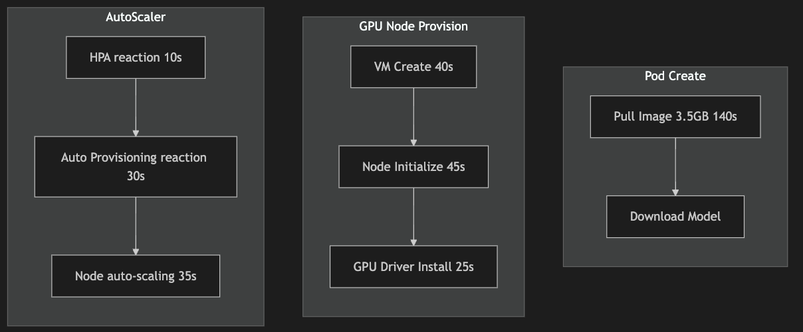

# 优化模型推理的冷启动


之前在做 Serverless 模型推理 [Modelz](https://modelz.ai/)，虽然现在已经 pivot 了，但是还是想分享一下如何优化模型推理的冷启动问题。由于我们的服务是基于容器调度，所以这里也涉及到了容器的冷启动问题。


# 优化模型推理的冷启动

## 问题

首先我们看下 Serverless 模型推理，从用户请求到模型推理的过程：

<details>
  <summary>Click me</summary>
  
  ```mermaid 
  sequenceDiagram
      participant User
      participant Cloudflare 
      participant Ingress 
      participant AutoScaler 
      participant Node
      participant containerd
      User->>Cloudflare: Model Call
      Cloudflare->>Ingress: Request
      Ingress->>AutoScaler: Request
      AutoScaler->>Node: Scale Up
      Node->>containerd: Container
      Note right of containerd: 1. Pull Image <br>2. Start Container<br>3. Download model
  ```
</details>

<div align="center">
  
</div>

整个流程的链路很长，但是真正耗时的地方在最后 Containerd 拉取镜像和启动容器的过程。我们将这个部分进一步细化,这里的每个阶段的时间大致来自于引用1：

<details>
  <summary>Click me</summary>
  
  ```mermaid
  flowchart TD
      subgraph Pod Create
      3A[Pull Image 3.5GB 140s] --> 3B[Download Model]
      end
      subgraph GPU Node Provision
      2A[VM Create 40s] --> 2B[Node Initialize 45s]
      2B --> 2C[GPU Driver Install 25s]
      end
      subgraph AutoScaler
      1A[HPA reaction 10s] --> 1B[Auto Provisioning reaction 30s] --> 1C[Node auto-scaling 35s]
      end
  ```
</details>

<div align="center">
  
</div>

如果是 30G（在 AI 推理场景并不稀有） 的镜像，那么拉取时间将超过 15min, 这个时间对于用户来说是不可接受的。

而模型下载取决于模型的大小以及模型是否已经存在于 Pod 中，这个时间也是不可控的，但是后文我们也会针对性的提出优化方案。

## Deep Dive

### Why image is so large?

<div align="center">
  
</div>

<div align="center">
  
</div>

由上面两张图可以看到
1. 除了 NVIDIA Kernel Driver 以及 CUDA Lib 放在 Host 上，AI 应用程序以及框架所依赖的库都放在镜像中。
2. NVIDIA 的策略导致你无法大幅缩减你的镜像，你不知道哪些库会被使用，所以你只能把所有的库都放在镜像中。

## 我们尝试过的解决方案

### 1. 预热

首先我们会使用 [cluster-proportional-autoscaler](https://github.com/kubernetes-sigs/cluster-proportional-autoscaler) 根据既定规则，比如总节点为 8 的时候该类型 GPU 资源扩容到 2 个节点即使没有请求，也有预留 bubble. 然后根据 image 使用频率，使用 [kube-fledged](https://github.com/senthilrch/kube-fledged) 在这些节点上创建 ImageCache，这样在真正请求的时候，镜像已经在节点上了。

### 2. Cache 模型

我们开发了一个 HuggingFace 的模型缓存服务，这个服务会在模型被调用的时候，通过比对模型的 hash 值，如果模型已经存在缓存服务中，那么直接返回缓存的模型，否则下载模型到缓存服务中。

### 3. GCP Image Streaming

利用 [GCP Image Streaming](https://cloud.google.com/blog/products/containers-kubernetes/introducing-container-image-streaming-in-gke) 将自己管理的镜像或者用户自定义的镜像转换到 GCP 的 Artifact Registry 中，在节点拉取镜像时，通过网络 mount container layers 到节点上，让 containerd 误以为镜像已经在节点上。但是这个方案有几个缺点：
1. 需要 GCP 的支持, vendor lock-in
2. 用户镜像需要 proxy 转换到 GCP，这个过程会有一定的延迟
3. 虽然 pod running 但是不是真正的完全可运行，可能会导致运行时缓慢

### 4. 更换镜像格式 

将 OCI 镜像格式转换成 [nydus](https://github.com/dragonflyoss/nydus) 格式，并结合 lazy pulling 技术 [zran](https://github.com/dragonflyoss/nydus/blob/master/docs/nydus-zran.md), 测试下来有着数倍的提升。就是需要修改 containerd 配置，支持 nydus。 配合 [Dragonfly](https://github.com/dragonflyoss/dragonfly) 的 P2P 技术，可以进一步提升镜像拉取速度。

### 5. 使用 JuiceFS 构建模型缓存集群

通过构建独立缓存池，将模型缓存到 JuiceFS 中。通过 JuiceFS CSI 将缓存目录挂载到容器中，如果模型已经存在 JuiceFS 中，那么直接使用，不存在则下载并直接缓存到 JuiceFS 中。这套架构主要是利用 JuiceFS Posix 以及使用对象存储的优势，无需关注缓存大小。这里需要对 JuiceFS 的参数进行调优，比如 prefetch block, buffer size 等。


## 后续可能的优化
- 使用 GCP 的 [image preloading](data-container-image-preloading) 功能，通过secondary boot disks preload 镜像到 node 上。
- In-class registry cache [spegel](https://github.com/spegel-org/spegel)。
- Parallel Downloading in Kubelet [KEP 3673](https://github.com/kubernetes/enhancements/blob/master/keps/sig-node/-kubelet-parallel-image-pull-limit/README.md)。
- [Parallel Container Layer Unpacking](https://github.com/containerd/containerd/issues/8881), 这里在引用1中提到 containerd 需要实现 high IO queue depth 才能充分利用 EBS 的 throughput。
- [yetone 的方案](https://x.com/yetone/status/1858034646585368891): 
    > parse 了 Dockerfile，然后获得了 base image 和一系列 args、env 和 commands，并将其顺序合并起来 hash 了一下作为 s3 object key，然后在我们的 image builder job 的 pod 的 container 里起了 dind，然后在里面用 base image 起了新的 container 然后在里面执行上一步 parse 出来的 commands，执行完毕后把这个 container 的 rootfs 打成 tar 包并用 zstd 压缩然后上传到 s3
    
    > OCI image builder 和 containerd remote snapshotter，在 builder 侧自己构建镜像把所有 layer 只分成两个 layer ：环境（极大）和代码（极小），然后用 pzstd 和 s5cmd 流式压缩和流式上传到 s3，然后在 snapshotter 侧用 s5cmd 和 pzstd 流式下载和流式解压，直接打满了 GKE 的 disk IO，把 image 的拉取速度提升到了以前的 4 倍左右
- Modal lazying container loading
    > 
- Do some research on [ServerlessLLM OSDI24](https://www.usenix.org/system/files/osdi24-fu.pdf)

## 引用
1. https://www.youtube.com/watch?v=e6Oo2aoZPnA
2. https://www.youtube.com/watch?v=SlkEW4C2kd4

