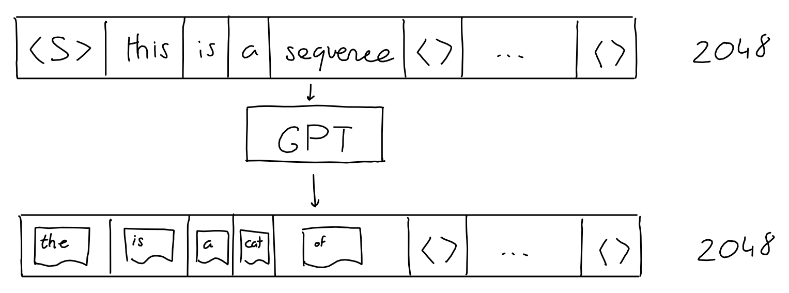
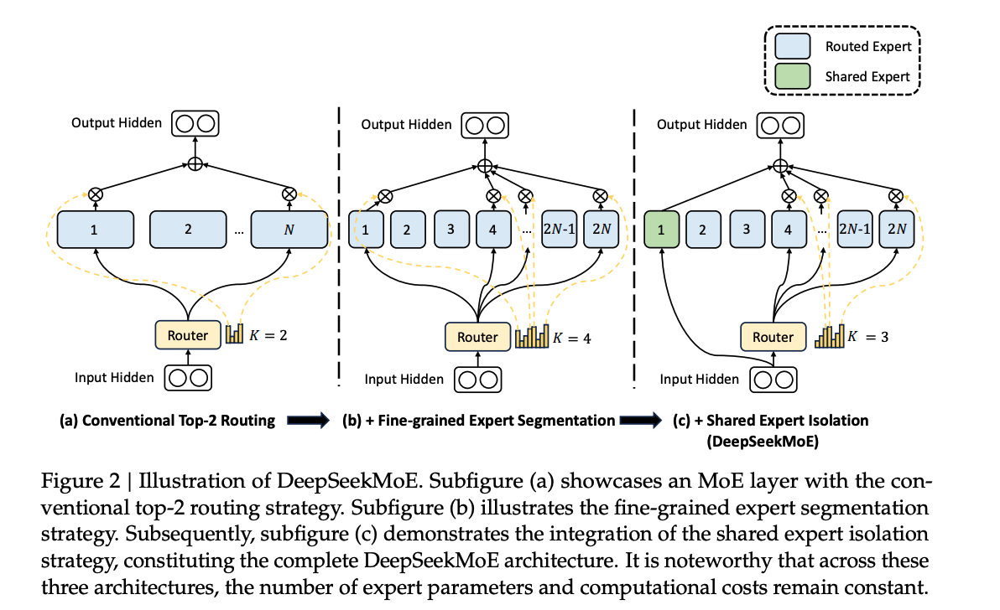

# LLM Infra 你需要知道的一切

# LLM Infra 你需要知道的一切

## GPT 3 

GPT 模型是 LLM 模型的起点，你如果说 Transformer 是，那也没错。既然我们要讨论 LLM Infra，那么我们需要知道我们的系统架构以及设计是给谁服务的。如果不了解模型架构，你对于后面介绍的 Infra 设计，比如推理阶段的 Prefill-Decode Disaggregation，Context Cache Migration，Traffic-Adaptive Request Routing 等，就会感到困惑。知其然，知其所以然。我们从 GPT3 开始，因为 GPT1 以及 GPT2 的参数量都太小了，GPT2 参数只有 1.5B, 而 GPT3 参数有 175B。如果对 Transformer 架构不熟悉，推荐这篇文章 [How Transformers Work](https://www.datacamp.com/tutorial/how-transformers-work);中文用户推荐知乎文章 [Transformer模型详解（图解最完整版）](https://zhuanlan.zhihu.com/p/338817680)。

  

首先确定 GPT3 的输入输出：
-  输入：一段文本，长度为 2048 个 token
-  输出：输入 2048个 token 下一个 token 的概率分布

这里的 token 是使用 Byte Pair Encoding (BPE) tokenizer 进行标记的。比如我使用 [OpenAI Tokenizer](https://platform.openai.com/tokenizer) 对 `I am xieydd, I love GPT3.` 进行标记后的结果如下, token ids 为 [40, 716, 2124, 494, 88, 1860, 11, 314, 1842, 402, 11571, 18, 13]：

  

### Encoding

Tokenizer 后的 token ids 还只是一串数字，并非向量。我们需要将其向量化，每一个 token 转换成 50257 维向量，向量 token id 位置为 1， 其他位置为 0。这样我们就得到了输入向量，长度为 2048 * 50257 = 102760896。

  

### Embedding

这个向量太稀疏了，我们需要将其降维，将其降维到 2048 * 12288。

  

### Positional Encoding

由于 Transformer 没有像 RNN 那样的递归机制，因此使用位置编码来提供有关序列中每个 token 的位置的信息。这使他们能够理解句子中每个单词的位置。Transformer 使用 sin 以及 cos 结合的方式，让 position encoding 可以编码任意长的句子。

  

### Attention

Vector 以及 Positional Encoding 相加后，得到了输入向量，接下来我们就要进行 Attention 了。这里将 2048 * 12288 的输入简化成 3*512。

  

  

  

  

> Image from https://dugas.ch/artificial_curiosity/GPT_architecture.html

- 输入向量，通过权重 Wq, Wk, Wv 得到 Query, Key, Value。
- Query 与 Key 进行点积，然后除以根号 d
- 进行 softmax 得到 attention score
- attention score 与 Value 进行点乘

### Sparse Attention

GPT3 并没有使用 Attention, 而是使用 Sparse Attention。sparse attention 除了相对距离不超过 k 以及相对距离为 k，2k，3k，... 的 token，其他所有 token 的注意力都设为 0，如下图所示：

  

好处有两点：
1. 减少注意力层的计算复杂度，节约显存和耗时，从而能够处理更长的输入序列；
2. 具有“局部紧密相关和远程稀疏相关”的特性，对于距离较近的上下文关注更多，对于距离较远的上下文关注较少；

### Multi-Head Attention

  

GPT3 将上述过程重复执行 96 次，有96个头,最后将输出在列行进行 concat。

### Feed Forward

Feed Forward 层是一个全连接层，输入是 Multi-Head Attention 的输出，输出是 2048 * 12288。

  

### Add & Norm

将进入 Multi-Head Attention 的前的输入和 Feed Forward 的输出相加，然后进行 Layer Normalization。

  

### Decoding

我们需要将 Add & Norm 的输出 2048 * 12288 转换回 2048 * 50257，这样才能知道 2048 个 token 下一个 token 的概率分布。我们复用了 Embedding 层的权重，将其转置后与 Add & Norm 的输出相乘，得到 2048 * 50257 的输出。随后经过 Softmax 得到概率分布, GPT3 取 topk 个 token 作为输出。

  

  

了解了 GPT3 的架构，我们就可以更好的理解 LLM Infra 的设计。下面我们进入如何训练大模型的话题。这里我们使用目前 SOTA 的开源模型 [DeepSeek-V3](https://github.com/deepseek-ai/DeepSeek-V3) 来进行讲解。

## Infra

### GPU

集大成者 [GB200 NVL72](https://www.nvidia.com/en-us/data-center/gb200-nvl72/):
1. Blackwell Architecture
2. NVIDIA Grace CPU
3. Fifth-Generation NVIDIA NVLink
4. NVIDIA Networking
  - NVIDIA Quantum-X800 InfiniBand
  - NVIDIA Spectrum™-X800 以太网
  - NVIDIA BlueField®-3 DPU

#### CUDA

### Network

#### NVLink

机器内通信可以通过：
1. PCIe
2. 内存
3. NVLink

简单来说就是目前的 PCIe 5.0 的带宽无法满足 AI 分布式训练中参数同步的时间需求，需要带宽更大的机器内 device 通信的方式。[NVLink](https://www.nvidia.com/en-us/design-visualization/nvlink-bridges/) 是给单机多 GPU 之间提供高速互联的技术，替换 [PCIe](https://en.wikipedia.org/wiki/PCI_Express)。

  

随着 NVLink 的代次的发展，速度也在不断地提升，到目前第五代，单个 NVIDIA Blackwell Tensor Core GPU 支持多达 18 个 NVLink 100 GB/s 连接，总带宽可达 1.8 TB/s，比上一代产品提高了两倍，是 PCIe 5.0 带宽的 14 倍之多。

  

注意只有 SXM 口才能真正的使用 NVLink P2P 通信，而不是 NVLink Bridge 连接。

NVLink 最新的技术 [NVLink C2C interconnect](https://www.nvidia.com/en-us/data-center/nvlink-c2c/?ncid=no-ncid) 技术：将两个高性能 NVIDIA Blackwell Tensor Core GPU 和一个 NVIDIA Grace CPU 连接到两个 Blackwell GPU，最终的目的是使 NVIDIA GPU、DPU 和 CPU 能够与定制芯片实现一致互连, 速度达到 900 GB/s，下图是 NVIDIA GH200 Grace Hopper Superchip 的架构图：

  

#### NVSwitch

  

当 GPU 通过 NVLink 进行 P2P 连接时，最高总带宽可以达到 1.8TB/s, 但是每个 GPU 必须将相同的 1.8TB/s 连接分成七个专用的 256 GB/s 点对点连接，也就是 GPU 和 GPU之间的通信最大只能达到 1.8TB/s。如果想突破这个限制就需要 NVLink Switch, NVSwitch 其实是个 ASIC 芯片。 NVLink Switch 可以保证 GPU 之间的通信带宽达到 1.8TB/s 的完整带宽，大幅压缩通信时间，在推理过程中实时响应  tok/s/user 相对于没有 NVSwitch 的情况提升 1.4倍，而且batch 越大，提升越明显。

#### InfiniBand

参考 [知乎-AI 集群基础设施 InfiniBand 详解](https://zhuanlan.zhihu.com/p/673903240)。

机器间通信可以通过：
1. TCP/IP 协议
2. RDMA(Remote Direct Memory Access) 协议
  - InfiniBand
  - RoCE (RDMA over Converged Ethernet)
  - iWARP (Internet Wide Area RDMA Protocol)

RDMA 协议可以不像 TCP/IP 协议需要 CPU 参与，数据需要经过数据链路层，网络层，传输层，应用层，CPU 参与数据包的接受，解包等操作。RDMA的内核旁路机制，允许应用与网卡之间的直接数据读写，同时RDMA的内存零拷贝机制，允许接收端直接从发送端的内存读取数据，极大的减少了CPU的负担，提升CPU的效率。

  

RDMA网络，分为三类分别是Infiniband、RoCE、iWARP。其中，Infiniband 是一种专为 RDMA 设计的网络，从硬件级别保证可靠传输，而 RoCE 和 iWARP 都是基于以太网的 RDMA 技术，支持相应的 verbs 接口。

  

IB（InfiniBand）： 搭建基于 IB 技术的 RDMA 网络需要专用的 IB 网卡和 IB 交换机。

iWARP（Internet Wide Area RDMA Protocal）： 基于 TCP/IP 协议的 RDMA 技术，由 IETF 标 准定义。iWARP 支持在标准以太网基础设施上使用 RDMA 技术，但服务器需要使用支持 iWARP 的网卡。

RoCE（RDMA over Converged Ethernet）： 基于以太网的 RDMA 技术，也是由 IBTA 提出。RoCE 支持在标准以太网基础设施上使用RDMA技术，但是需要交换机支持无损以太网传输，需要服务器使用 RoCE 网卡。

IB 链路速率随着网络带宽的升级越来越快，如下图：

  

这里的 x4, x12 是线缆中 Link 数量，x4 代表 4 个 Link，x12 代表 12 个 Link，一个 Link 一来一回两条线。

InfiniBand 的线缆有别于以太网线缆以及光纤线缆，InfiniBand网络互连产品包括：DAC高速铜缆、AOC有源线缆以及光模块。

Mellanox 在全球 InfiniBand 市场的占有率基本上无敌的存在，在英伟达收购 Mellanox 之后，也于2021年推出了自己的第七代 NVIDIA InfiniBand 架构：NVIDIA Quantum-2。

NVIDIA Quantum-2 平台包括：NVIDIA Quantum-2 系列交换机、NVIDIA ConnectX-7 InfiniBand 适配器、BlueField-3 InfiniBand DPU以及电缆。
目前最新的是：
- NVIDIA Quantum-X800 InfiniBand
  - NVIDIA® ConnectX® InfiniBand HCAs(Host Channel Adapters),ConnectX-8 InfiniBand SuperNIC 可提供每秒 800 Gb/s 的数据吞吐量
  - InfiniBand Switches 最高 144 个口，每个口 800 Gb/s 一共 115Tb/s
- NVIDIA Spectrum™-X800 以太网
  - 通过 SuperNICs 以及 NVIDIA Spectrum-X800 SN5600 Ethernet switch 提供 800 Gb/s 的吞吐量
  - Switch 最高 64 个口，每个口 800 Gb/s 一共 51.2Tb/s
- NVIDIA BlueField®-3 DPU
  - 支持以太网以及 InfiniBand 连接， 400Gb/s 速度
  - NVIDIA DOCA 软件框架进行 SDN 
  - 网络、安全、存储、管理、AI 加速等功能
- BlueField SuperNICs: Provides best-in-class remote direct-memory access over converged Ethernet (RoCE) network connectivity between GPU servers at up to 400Gb/s。

GPUDirect 是 NVIDIA 开发的一项技术，可实现 GPU 与其他设备（例如网络接口卡 (NIC) 和存储设备）之间的直接通信和数据传输，而不涉及 CPU。
GPU Direct 技术包括 GPUDirect Storage、GPUDirect RDMA、GPUDirect P2P 和 GPUDirect Video。
- GPUDirect P2P 主要是单机多卡场景下，让 GPU可以通过PCI Express直接访问目标GPU的显存
- GPUDirect RDMA 主要是在多机多卡场景下，计算机1的GPU可以直接访问计算机2的GPU内存，而不需要 CPU -> CPU 再由计算机 2 的 CPU -> GPU 多次拷贝

#### Communication

MPI (Message Passing Interface) 是一种并行计算中常用的通信协议，MPI 有多种实现，比如 OpenMPI, Gloo, NCCL 等。

NCCL（Nvidia Collective multi-GPU Communication Library）实现了针对 NVIDIA GPU 性能优化的多 GPU 和多节点集合通信原语。NCCL 提供了诸如 All Gather，All Reduce，Broadcast，Reduce，Reduce-Scatter 等实现，这些实现优化后可以通过 PCIe、 NVLink、InfiniBand 等高速互联，从而实现高带宽和低延迟。

介绍几种通信原语：
- Reduce：从多个sender那里接收数据，最终combine到一个节点上。
  

    
  

- AllReduce：Reduce 的变种，将所有节点的数据都reduce到所有节点上。
  

    
  

- Broadcast：一个节点将数据发送到所有节点。

不同的网络拓扑对 NCCL 通信的速度有很大影响，如下图所示：

  

- 第一种是两个GPU通过CPU然后通过QPI和另一个CPU上的两块卡相连，因此速度最慢，但也能达到>5GB/s。
- 第二种是两个GPU通过PCIe switch相连后再经过CPU连接，速度会稍微低一点。
- 第三种是四张卡都在一个PCIe switch上，所以带宽较高，能达到>10GB/s PCIe的带宽大小。
- 第四种是DGX-1架构，通过 NVLink 直接连接，速度最快，能达到 60GB/s。

  

- 左图2机8卡，机内PCIe，机间InfiniBand能达到>10GB/s的速度，InfiniBand基本上能达到机内的通信速度；
- 右图4机32卡，机内NVLink，机间InfiniBand，带宽能达到>40GB/s。

NCCL P2P 的几种 Level:
- LOC：从不使用P2P（始终禁用）
- NVL：当 GPU 通过 NVLink 连接时使用 P2P
- PIX：当 GPU 位于同一 PCI 交换机上时使用 P2P。
- PXB：当 GPU 通过 PCI 交换机（可能是多跳）连接时使用 P2P。
- PHB：当 GPU 位于同一 NUMA 节点上时使用 P2P。 流量将通过 CPU。
- SYS：在 NUMA 节点之间使用 P2P，可能跨越 SMP 互连（例如：QPI/UPI）。

## Training

大模型训练，这里我们主要参考 Andrej Karpathy 在 2023 年 MSBuild 的分享，分为以下四个阶段：
1. Pre-training
2. Supervised Fine-Tuning
3. Reward Modeling
4. Reforcement Learning

在介绍这四个阶段之前，首先普及下 Hardware 的只是，因为大模型训练需要大量的计算资源，比如 GPU，此外数据的存储和网络通信都是需要考虑的。

### Hardware

#### GPU

一提到 GPU （Graphics Processing Unit）我们自然而然将其和 NVIDIA 挂钩，这个是有一定的道理的，因为 NVIDIA 的 GPU 在深度学习领域占有很大的市场份额。不过这个市场巨大，有 AMD 以及 Brodcom 的 Application-specific Integrated Circuits (ASICs) 芯片也在不断地吞噬市场份额。

虽然 GPU 带了个 Graph，但是在 AI 中我们更多的是使用 GPGPU (General-purpose computing on graphics processing units)。如果你不了解 GPU 的术语，推荐你看看 Modal 维护的 [GPU 术语表](https://modal.com/gpu-glossary)。GPU 相对于  CPU 

#### Network

#### Storage System

### Pre-training

Pretaining model 是大模型训练最消耗算力和数据的阶段，这个阶段的目标是让模型学习到语言的基本规律，比如语法，语义等。这个阶段的数据量很大，通常是 TB 级别的数据，通常是几周到数月。这个阶段的训练通常是无监督的，也就是说我们不需要标注数据。这个阶段的训练通常是在大规模的 GPU 集群上进行的，比如 OpenAI 的 GPT3 数千张 V100 上训练一个月天。

作为最消耗计算资源的预训练，我们在这个章节来分享 LLM 训练的一些技术，比如说分布式训练并行技术，训练优化技术。

#### Distributed Training

参考 OpenAI 的文章 [Techniques for training large neural networks
](https://openai.com/index/techniques-for-training-large-neural-networks/), 主要分为以下四个部分：
1. Data Parallelism
2. Pipeline Parallelism
3. Tensor Parallelism
4. Expert Parallelism

  

1. 这里不同颜色的块代表模型不同的层
2. 虚线代表分割到不同的 GPU
3. 箭头表示模型的前向传播以及反向传播

##### Data Parallelism

Data Parallelism 将数据分成不同的 subset, 然后分发到不同的 GPU 上。对于每一个 GPU, 模型是完整的，所以每一个 GPU 都需要存储模型完整的参数。所以当 GPU 显存无法存储模型参数时，Data Parallelism 就不适用了，不过现在有些 Offload Memory 的技术或者 KV Cache 可以缓解这个问题。

正是因为每个 GPU 需要完整的参数，所以当更新的时候，需要保证工作线程（一般和 GPU 保持一致）的参数保持一致。这样在工作线程上需要引入阻塞通信：
1. 每个 worker 计算梯度
2. 平均每个 worker 的梯度
3. 每个 worker 更新参数 

当参数量越大，线程数越多，这个阻塞通信的开销就越大，当然可以使用异步的方式进行通信，但是这样可能会损害学习率，得不偿失，尤其对于 LLM 模型，投入资源大，不容有失。GPU 之间的通信通过 NCCL (NVIDIA Collective Communication Library) 这个库来实现。上述通信过程通常的叫法是 AllReduce 如下图所示：

  

我们注意到如果 AllReduce 在一个单独的进程进行处理，那么这个进程需要 Gather All 以及 Scatter All, 这样单进程的通信开销和节点数以及参数量成正比。为了消除节点数以及参数量带来的阻塞等待浪费，我们可以使用 Ring AllReduce，如下图所示：

  

首先将 N 个 worker 构建一个 ring, 每个进程将数据划分成 N 个 chunk。

  

第 N 个 worker 将第 N 个 chunk 发送给第 worker[N+1]，同时从 worker[N-1] 接受 chunk。

  

第 N 个 worker 将接受到的 N-1 chunk 和自己的 N-1 chunk 进行 reduce，然后发送到 worker[N+1]。

  

重复接受，reduce，发送的过程，重复 N-1 次，这样每个 worker 获得结果的一部分。最后再进行一轮的 Send 操作而不做 reduce 操作，这样每个 worker 就获得了最终的结果。

##### Pipeline Parallelism (Model Parallelism)

Pipeline Parallelism 将模型分成不同的 stage, 然后分发到不同的 GPU 上。对于大模型来说，比如 LLaMA 65B, 如果参数是 FP32 那么总显存需要 260GB 但是一般训练都采用半精度也就是 FP16，那么也需要 130GB 显存，目前最前进的 H200 显存也就是 80GB。目前来自 DeepSeek 团队训练的 [DeepSeek V3](https://huggingface.co/deepseek-ai/DeepSeek-V3) 已经首次在超大规模模型上验证了FP8训练的可行性和有效性。但是 DeepSeek V3 是 MOE (Mixtures of Experts) 模型，参数达到 671B, 这个我们后面再聊。

  

1. 模型每一层的输入和输出都有顺序，F 代表 Forward, B 代表 Backward, U 代表 Update
2. 每个 worker (GPU) 在同一时间只负责处理一个 stage
3. 时间序列上，资源利用出现大量的气泡

为了优化这个问题，我们可以将刚才 ring allreduce 的思想拿过来，也就是将一个 batch 数据进行切分，将计算时间和等待时间 overlap，如下图所示：

  

上图为 GPipe 的示意图，GPipe 将模型 layer 的 chunk 数据的激活值连续传递给下一个 worker，也连续进行向后传递。然后同步聚合梯度，更新参数。

  

而 PipeDream 则让 worker 交替处理向前和向后传递。相对 GPiPe，PipeDream 有更好的资源利用率，但是需要更多的通信开销。

##### Tensor Parallelism

Tensor Parallelism 将模型的 operator 分成不同的 subset, 然后分发到不同的 GPU 上, 比如说矩阵乘法。Pipeline parallelism 是将模型的层分到不同的 GPU, 而 Tensor Parallelism 是将模型层内的 operator 分到不同的 GPU。对于现代模型比如 Transformer, 将激活值和大的权重进行点积计算是计算的瓶颈。比如 [MegatronLM](https://nv-adlr.github.io/MegatronLM) 在 Transformer 的Self-Attention 和 MLP 层进行了并行化矩阵乘法。[PTD-P](https://arxiv.org/abs/2104.04473) 使用tensor，pipeline，以及data parallelism， pipeline scheduler 为每个设备分配多个非连续层，以网络通信为代价减少气泡开销。

##### Expert Parallelism

Mixture-of-Experts (MoE) 是一种将模型每一层的某些部分放在同一个 GPU 上执行，这意味着你可以通过门控制器控制模型中哪些部分会应用到本次输入和输出。每一组门控制的一组参数都是一个 Expert，不同的 Expert 在不同的 GPU 上。

  

很明显 MoE 架构可以显著的提升模型的大小，这来源于一个经验，在有限的计算资源预算下，用更少的训练步数训练一个更大的模型，往往比用更多的步数训练一个较小的模型效果更佳。特别是在预训练阶段，与稠密模型相比，混合专家模型通常能够更快地达到相同的质量水平。MoE 是基于 Transformer 架构的，由下面两个部分组成：
1. 稀疏 MoE 层：MoE 层有若干个专家，如下图为 8 个专家，这些专家可以是 FFN 层，也可以是 MoE 层，像俄罗斯套娃。
2. 门控网络或路由：这个路由决定 token 会被发送到哪个专家，路由器的参数会在训练中进行训练。

  

上面讲到 MoE 的优点，但是 MoE 也有一些缺点：
1. 微调过程中泛化能力不足，容易过拟合
2. 推理过程中需要加载所有的参数到内存，即使只有一个专家被激活，比如  Mixtral 8x7B ，VRAM 需要放的下 47B 的参数，这里不是 56B 是因为 MoE 只有 FFN 是独立的，其他层会共享参数。
3. Token 被路由到不同的专家，导致批量大小分布不均，导致计算资源浪费。

对于门控网络，除了最典型的带有 Softmax 的网络，还有其他网络，比如包括带噪声的 TopK 门控 (Noisy Top-K Gating)，引入可调节的随机噪声并保留前 k 值。
- 随机噪声是为了让专家间的负载更加均衡，在训练过程中才避免只有受欢迎的专家得到训练，在 transformers 库中，可以通过 aux_loss 参数来控制辅助损失。
- topk 可以选择性的保留前 k 个值，加速训练和推理

列举两个典型的 MoE 模型或者说方法：
1. Gshard

  

为了保证负载平衡和训练效率，Gshard 除了使用上述的辅助损失外，还进行了以下的优化：

- 随机路由: 在 Top-2 设置中，我们始终选择排名最高的专家，但第二个专家是根据其权重比例随机选择的。
- 定义一个专家能处理多少令牌。如果两个专家的容量都达到上限，令牌就会溢出，并通过残差连接传递到下一层，或在某些情况下被完全丢弃。

2. Switch Transformer

Switch Transformer 使用接受两个输入，每个输入4个专家，而并非单输入，至少两个专家的设定。这样做的优势是：
1. 减少门控网络 (路由) 计算负担
2. 每个专家的输入 batch 至少可以减半
3. 降低通信成本，保持模型质量

于此同时 Switch Transformer 也对专家容量进行了研究，通过大于 1 的容量因子为 token分配不均匀时提供缓冲。提高容量因子 (Capacity Factor, CF) 可以增强模型的性能，但这也意味着更高的通信成本和对保存激活值的显存的需求。 
在训练期间，对于每个 Switch 层的辅助损失被添加到总模型损失中。这种损失鼓励均匀路由，并可以使用超参数进行加权。
Switch Transformer 还探索了混合精度，也就是专家使用原始精度，其他部分使用 Bfloat16 精度，在保证训练稳定性的同时，增加了训练速度。

ST-MoE 的研究者们发现，编码器中不同的专家倾向于专注于特定类型的令牌或浅层概念。例如，某些专家可能专门处理标点符号，而其他专家则专注于专有名词等。与此相反，解码器中的专家通常具有较低的专业化程度。

训练 MoE 模型有哪些 tricks:
1. 稀疏模型更易于出现过拟合现象，因此在处理这些模型时，尝试更强的内部正则化措施是有益的，比如使用更高比例的 dropout。例如，我们可以为稠密层设定一个较低的 dropout 率，而为稀疏层设置一个更高的 dropout 率，以此来优化模型性能；
2. MoE 模型在小任务比如 SuperGLUE 容易过拟合，不如在大任务比如 TriviaQA 效果好；
3. 冻结 MoE 参数进行微调，可以显著加速并且对模型效果影响很小；
4. MoE 适合更小的 batch 和更高的学习率；
5. 在稀疏模型上进行微调效果好用稠密模型。

对于稀疏模型和稠密模型如何选择呢？
1. 稀疏混合专家模型 (MoE) 适用于拥有多台机器且要求高吞吐量的场景。在固定的预训练计算资源下，稀疏模型往往能够实现更优的效果。相反，在显存较少且吞吐量要求不高的场景，稠密模型则是更合适的选择。
2. 直接比较稀疏模型和稠密模型的参数数量是不恰当的，因为这两类模型基于的概念和参数量的计算方法完全不同。

  

我们刚才在讲分布式训练的优化手段，讲到了 Expert Parallelism，从而引申到 MoE 模型，那么为什么 MoE 模型需要 Expert Parallelism 呢？
1. 在 Expert Parallelism 中，专家被放置在不同的设备上，每个设备处理不同批次的训练样本；
2. 当单个专家参数可以在一个设备上时候，采用数据并行和专家并行的方式训练
3. 如果单个专家模型不能再一个设备上，需要加入模型并行，将单个专家模型分布到不同的设备上，同时配合数据进行并行训练加速

部署专家模型优化方式：
1. 对专家模型进行蒸馏
2. 路由器被修改为将整个句子或任务直接路由到一个专家。这样做可以提取出一个用于服务的子网络，有助于简化模型的结构。
3. 合并各个专家的权重，在推理时减少了所需的参数数量

#### Prepare Data

LLaMA 做 Pre-training 时的训练数据如下所示： 

  

收集完原始数据后，需要进行数据处理，比如 Tokenization。

  

#### Model

我们看下 2020 年 GPT3 以及 2023 年 LLaMA 模型的一些参数对比：

  

解释下上图中的参数：
1. Vocabulary Size: 50257。这是指的是 Tokenizer 中词汇表的数量，也就是输入向量的维度。
2. Context Length: 2048。这是指的是生成模型在生成下一个 token 之前会看到的窗口的大小。
3. 虽然 GPT3 训练的参数量是 175B，而 LLaMA 只有65B 但是 LLaMA 训练的 token 1.5T > GPT3 300B。
4. 一些训练的超参数，比如 batch size, learning rate, 头数量以及模型层数等。

训练的输入如果是以下文本, 这里会由特殊 token `<|endoftext|>` 进行标记 
- Row 1: Here is an example document 1 showing some tokens.
- Row 2: Example document 2<|endoftext|> Example document 3<|endoftext|> Example document 
- Row 3: This is some random text just for example<|endoftext|> This
- Row 4: 1,2,3,4,5

Tokenization 后的结果如下：

  

这里 Batch 取 4，Context Length 取 10。其中每个单元格只能看见同行的单元格，绿色的是当前 highlight 的 token 所能看到的 context, 红色是它的目标。

#### Training

### Supervised Fine-Tuning

在这个阶段需要小的高质量的数据，一般是人类标注的数据，比如 prompt 以及相应理想的回复， 一般需要 10~100k。

这一阶段会将 Pre-training 的模型加载进来，然后在这个数据集上进行训练，得到的数据就是 SFT(Supervised Fine-Tuning) 模型。这时候你可以部署这个模型，提供类似 QA 的服务了。

### Reward Modeling

RLHF(Reward Learning from Human Feedback) 阶段分为两个部分，一个是 Reward Model，一个是 Reinforcement Learning。

Reward Model 会将数据收集变成比较的形式，举个例子

  

这里，人类需要输入相同的指令，在不同的输出中进行 Rank，得到 pair 数据集，大概 100k~1M。

训练中:

  

1. 每一行的蓝色 prompt 是一样的
2. 黄色是 SFT 模型输出
3. 绿色是 reward token，也就是 SFT 评价模型输出的质量，和人类评价的质量进行比较
4. 损失函数衡量 reward token 与人类标记的 ground truth 的一致性

### Reinforcement Learning

准备 10k~100k 的 Prompt 数据, Reward Model 对这些模型进行训练, 100 GPUs天级别。

  

1. 每一行的蓝色 prompt 是一样的
2. 黄色是 SFT 模型输出, 作为初始化值，作为 Reward Model 的训练数据
3. 绿色是 reward token，这个 token 会将 sampled token, 也就是黄色部分进行评价，如果高，则黄色部分 token 在后续的采样中会被采样的概率会增加。

PPO 算法就是 RLHF 模型, 为什么要使用 RLHF, 参见下图，RLHF 可以显著减少 predict 的熵，也就是预测的更加稳定。

  

## Serving

### Model Optimization

模型这块本来想放在 [Model](#model) 里面，但是这里的模型优化主要是让推理更快，所以放在 Serving 里面。

#### MHA vs MQA vs GQA vs MLA

这里首先解释下这几个名词：
- MHA: Multi-Head Attention
- MQA: Multi-Query Attention
- GQA: Global Query Attention
- MLA: Multi-Latent Attention

参看苏大的博客 [缓存与效果的极限拉扯：从MHA、MQA、GQA到MLA](https://kexue.fm/archives/10091)。

##### MHA
在 Transformer 解码器中，由于 token 的注意力依赖于前面的 token，因此不会重新计算前面的上下文，而是缓存其 Key 和 Value, 为什么没有缓存 Query 呢？  

  

如下面这个 不带 Causal Mask 的 Attention 公式，从上到下，在 T 阶段，只有 Q 参与了每一个地方的计算，但是 K 和 V 是已经算好的，不需要再次计算。但是引入 KV Cache 后虽然计算量减少了，但是常驻内存占用增加了，而且随着 Context 长度的增长，对显存的占用也越大，单卡可能无法放得下。如果拓展到多卡或者多机，那么将会引入通信带宽的瓶颈限制。所以这一章节就是为了优化这个 KV Cache 的问题。

##### MQA

MQA（Multi-Query Attention） 思想比较简单，就是所有 header 的 Q 共用一个 K V，所以 KV Cache 就减少到原来的 1/h。其缺点就是对模型性能会带来一定的影响。

##### GQA

GQA（Grouped-Query Attention）为了缓解 MQA 对模型性能带来的影响，讲 h 个 Head 划分为 g 个 Group, 这样 KV Cache 就压缩原先的 h/g 倍。llama2/3-70B中，GQA的g=8，h=32。这里的 g=8 是考虑到单机 8 卡，这样在做计算时尽可能保证K、V多样性的同时最大程度上减少卡间通信。

##### MLA

MLA（Multi-Latent Attention）很多的数学概念，对于我有点复杂了，可以参看上面苏大的博客。我总结下思路吧：
1. 在 GQA 的基础上，将 K, V 拼在一起看做由输入和一个参数矩阵的乘积结果[K,V] = x.W
2. 通过不同的投影矩阵来增强了GQA的能力，并且推理时可以保持同样大小的KV Cache
3. 那么反过来，如果我们只需要跟GQA相近的能力，那么 dimension W 取更小的值（DeepSeek-V2取了512），从而进一步压缩KV Cache。

### Serving Pattern

随着 Chat，Code Assistant 等 LLM 应用的蓬勃发展，LLM Serving 由单卡逐步拓展到多卡，甚至是多个实例。由此衍生出 Orchestration Pattern, 例如 prefill-decode disaggregation, context cache migration, traffic-adaptive request routing 等。

#### Prefill-Decode Disaggregation

#### Context Cache Migration

#### Traffic-Adaptive Request Routing

## DeepSeek V3

在最后，我们来分析下国产的 LLM 模型 DeepSeek V3，这个模型是由 DeepSeek 团队开发的，通过分析和我们上面的技术做对应。
目前 DeepSeek-V3 是在 14.8T token 上进行训练的 [MoE](#expert-parallelism) 架构，总参数为 671B，每个 token 激活 38B。 完整训练在 H800 上用时 2.788M hours。
### Architecture

  

如上图所示，DeepSeek-V3 采用了 MoE 架构，其中：
- 原始 Transformer 中的 Decode 部分的 FFN 层被替换成了 MoE 层，这里使用的是 DeepSeekMoE；
- 原始 Transformer 架构中的 Multi-Head Attention 层被替换成了 Multi-Latent Attention 层。

#### DeepSeekMoE

参看 [DeepSeekMoE论文阅读](https://zhuanlan.zhihu.com/p/17791774183)，这个架构主要是让专家是真正的专家（具有非重叠且集中的知识），避免专家间的知识杂交和知识冗余,在更少的资源占用情况下获得更好的性能。

  

DeepSeekMoE引入了两项核心策略：
- 细分专家为更小单位，并从中激活更多组合，允许更灵活地选择激活的专家。
  - 这个策略的直觉是如果 token 可分配的专家越少，那么这些专家就很难学到有差异化的知识
  - 为了在增加 token 可分配专家的情况下不增加计算量，将激活专家拓展 N 倍的同时，将 FFN 的隐层维度缩减为 1/N
- 隔离部分专家作为共享专家，以捕捉通用知识并减少路由专家间的冗余
  - 有专门的共享专家来捕捉和整合不同上下文中的通用知识，则可以减轻其他路由专家之间的参数冗余。这种冗余的减少将有助于构建一个参数效率更高、专家更加专业的模型。
  - 这里路由器将对共享专家不起作用，而是直接将 token 分配给共享专家。
  - 共享专家从总专家数剥离，也就是细分专家=总专家-共享专家

#### Multi-Latent Attention

该方法来自于 [DeepSeek-V2](https://arxiv.org/pdf/2405.04434v5)，参见 [MHA vs MQA vs GQA vs MLA](#mha-vs-mqa-vs-gqa-vs-mla)。

#### Auxiliary-loss-free strategy for load balancing 

辅助损失通过引入随机噪声让专家避免在训练过程中出现强者恒强的问题，但是也会损害模型的性能。而 `Auxiliary-loss-free strategy` 就是为了在负载平衡和模型性能之间实现更好的权衡。
具体做法：
1. 引入 bias
2. 在训练中发现哪些专家过载，则减少 𝛾（bias 更新速度的超参数） ,如果专家负载不足，增加 𝛾

但为了防止任何单个序列内的极端不平衡，还采用 Complementary Sequence-Wise Auxiliary Loss， 鼓励每个序列上的专家负载达到平衡，具体算法公式可以参看论文。

#### Node-Limited Routing

使用限制路由机制来限制训练期间的通信成本。确保每个代币将被发送到最多 𝑀 个节点，这些节点是根据分布在每个节点上的专家的最高 affinity score 之和来选择的。在此约束下，MoE 训练框架几乎可以实现 full computation-communication overlap, 也就是计算和通信可以同时进行不互相阻塞。

#### No Token-Dropping

DeepSeek-V3 在训练期间不会丢弃任何标记。此外，使用特定的部署策略来保证推理负载平衡，因此DeepSeek-V3在推理过程中也不会丢失令牌。

#### Multi-Token Prediction

  

参考 [知乎](https://zhuanlan.zhihu.com/p/16540775238)。

### Infrastructure

#### 集群状态

1. 256节点，一个节点8张卡，一共 2048 个 NVIDIA H800 GPU 
2. 卡和卡之间通过 [NVLink](#nvlink) 和 [NVSwitch](#nvswitch) 进行连接，不同的节点间通过 [InfiniBand](#infiniband) 进行连接

#### 训练框架

HAI-LLM：
1. 8 个节点的 16 路 [Pipeline Parallelism](#pipeline-parallelism-model-parallelism)
  - DualPipe 重叠了前向和后向过程的计算和通信阶段，从而解决了跨节点专家并行带来的繁重通信开销的挑战
2. 64 路 [Expert Parallelism](#expert-parallelism)
  - cross-node all-to-all communication kernels to fully utilize InfiniBand (IB) and NVLink bandwidths. 
3. ZeRO-1 [Data Parallelism](#data-parallelism)
  - 精心优化了内存占用，从而使我们能够在不使用昂贵的张量并行（TP）的情况下训练
 

  

根据上图：
1. DualPipe 显著减小了气泡
2. DualPipe 将峰值激活内存增加了数倍，PP < 1
3. 尽管 DualPipe 需要保留模型参数的两个副本，但这并不会显着增加内存消耗，因为在训练期间使用了较大的 [EP](#expert-parallelism) 大小
4. 气泡和激活内存都不会因为 mini-batch 增加而增加

#### 通信

Cross-Node All-to-All Communication:
1. cross-node GPUs are fully interconnected with IB (50GB/s)
2. intra-node communications are handled via NVLink (160GB/s)
3. 如何有效利用 NVLink 和 IB 的不同带宽
  - 限制每个 token 最多调度到 4 个节点，从而减少 IB 流量
  - 每个 token 当做出路由决策时，它将首先通过IB传输到其目标节点上具有相同节点内索引的GPU。一旦它到达目标节点，我们将努力确保它通过 NVLink 立即转发到托管目标专家的特定 GPU，而不会被随后到达的令牌 block
  - 通过 IB 和 NVLink 的通信完全重叠，每个 token 可以有效地为每个节点平均选择 3.2 名专家，而不会产生 NVLink 的额外开销。这意味着，虽然 DeepSeek-V3 目前选择8个专家，但是可以拓展到 3.2x4 个。
  - 使用 warp specialization technique 将 Streaming Multiprocessor (SM) 分拆到 10 个 communication channels。
    - Dispatching 阶段：(1) IB 发送、(2) IB 到 NVLink 转发和 (3) NVLink 接收由各自的 warp 处理。分配给每个通信任务的warp数量根据所有SM的实际工作负载动态调整。
    -  Combining 阶段：(1) NVLink 发送、(2) NVLink 到 IB forwarding和accumulation、以及 (3) IB receiving和accumulation也由动态调整的 warp 处理。
    - dispatching and combining kernels overlap with the computation stream, so we also consider their impact on other SM computation kernels. 
    - Specifically, we employ customized PTX (Parallel Thread Execution) instructions and auto-tune the communication chunk size, which significantly reduces the use of the L2 cache and the interference to other SMs。

#### Memory Optimization

Extremely Memory Saving with Minimal Overhead：
1. Recomputation of RMSNorm and MLA Up-Projection 在反向传播的时候，消除了持续存储它们输出激活的需求。通过轻微的额外开销，这种策略显著降低了存储激活所需的内存需求。
2. Exponential Moving Average in CPU：在训练过程中，我们保留模型参数的指数移动平均（EMA）以在学习率衰减后早期估计模型性能。EMA参数存储在CPU内存中，并在每次训练步骤后异步更新。这种方法使我们能够保持EMA参数，而不会产生额外的内存或时间开销。
3. Shared Embedding and Output Head for Multi-Token Prediction：采用DualPipe策略，将模型的最浅层（包括嵌入层）和最深层（包括输出头）部署在同一个PP rank上。这种安排使得MTP模块和主模型之间可以物理共享参数和梯度，共享嵌入和输出头。这种物理共享机制进一步提高了我们的内存效率。

FP8 Mixed Precision Training：

  

1. 使用 1 × 𝑁元素进行分块分组或使用 𝑁× 𝑁元素进行块分组。在提高精度的累加过程中，相关的反量化开销在很大程度上得到了缓解
2. 为了进一步减少 MoE 训练中的内存和通信开销，在 FP8 中缓存和调度激活，同时在 BF16 中存储低精度优化器状态。
3. 大部分核心计算内核，即GEMM运算，都是以FP8精度实现的。这些 GEMM 运算接受 FP8 张量作为输入并产生 BF16 或 FP32 格式的输出。如上图所示，与线性算子相关的所有三个 GEMM，即 Fprop（前向传递）、Dgrad（激活后向传递）和 Wgrad（权重后向传递）均在 FP8 中执行。该设计与原始BF16方法相比，理论上计算速度提高了一倍。此外，FP8 Wgrad GEMM 允许将激活存储在 FP8 中，以便在向后传递中使用。这显着减少了内存消耗
4. 保持以下组件的原始精度（例如 BF16 或 FP32）：嵌入模块、输出头、MoE 门控模块、归一化算子和注意力算子。

  

1. 细粒度的量化方法，该方法在更细粒度的级别上应用缩放。如上图所示，(1) 对于激活，我们在 1x128 图块基础上对元素进行分组和缩放（即每 128 个通道的每个标记）； (2) 对于权重，我们在 128x128 块的基础上对元素进行分组和缩放（即每 128 个输入通道每 128 个输出通道）。这种方法确保量化过程可以通过根据较小的元素组调整比例来更好地适应异常值。
2. 沿着 GEMM 操作内部维度引入缩放因子
3.  microscaling formats with smaller quantization granularity will be supported in Tensor Cores of NVIDIA next-generation
GPUs (Blackwell series)
4. Underflow issues：在 Tensor Core 上执行 MMA（矩阵乘法累加）期间，使用有限的位宽来累加中间结果。一旦达到间隔 𝑁，这些部分结果将被复制到 CUDA 内核上的 FP32 寄存器，在其中执行全精度 FP32 累加。如前所述，我们的细粒度量化沿内部维度 K 应用每组缩放因子。这些缩放因子可以在 CUDA 核心上有效地相乘，作为反量化过程，且附加计算成本最小。
5. 值得注意的是，这一修改降低了单个warpgroup的WGMMA（Warpgroup级矩阵乘法累加）指令发出率。然而，在 H800 架构上，两个 WGMMA 并发持续是很典型的：当一个 warpgroup 执行提升操作时，另一个 Warpgroup 能够执行 MMA 操作。这种设计可以实现两个操作的重叠，从而保持 Tensor Core 的高利用率。根据实验，设置 𝑁= 128 个元素，相当于 4 个 WGMMA，代表最小累积间隔，可以显着提高精度，而不会引入大量开销。

Low-Precision Storage and Communication:
1. 将缓存的激活和优化器状态压缩为较低精度的格式，进一步减少了内存消耗和通信开销。低精度优化器状态。我们采用 BF16 数据格式而不是 FP32 来跟踪 AdamW（Loshchilov 和 Hutter，2017）优化器中的第一和第二时刻，而不会导致可观察到的性能下降。然而，主权重（由优化器存储）和梯度（用于批量大小累积）仍保留在 FP32 中，以确保整个训练过程中的数值稳定性。
2. 低精度激活。Wgrad 操作在 FP8 中执行。为了减少内存消耗，自然选择以 FP8 格式缓存激活以用于线性算子的向后传递。但为了低成本高精度训练，对几个算子进行了特殊考虑：
  - 注意力算子之后的线性输入。这些激活也用于注意算子的向后传递，这使得它对精度敏感。专门为这些激活采用定制的 E5M6 数据格式。此外，这些激活将在后向传递中从 1x128 量化图块转换为 128x1 图块。为了避免引入额外的量化误差，所有缩放因子均进行舍入缩放，即积分幂为 2。
  - MoE 中 SwiGLU 算子的输入。为了进一步降低内存成本，我们缓存 SwiGLU 运算符的输入，并在向后传递中重新计算其输出。这些激活也通过我们的细粒度量化方法存储在 FP8 中，在内存效率和计算精度之间取得平衡。
3. 低精度通信
  - 在 MoE 上投影到 FP8 之前对激活进行量化，然后应用调度组件，该组件与 MoE 上投影中的 FP8 Fprop 兼容。与注意力算子之后的 Linear 输入一样，此激活的缩放因子是 2 的整数幂。类似的策略应用于 MoE 下投影之前的激活梯度。对于前向和后向组合组件，我们将它们保留在 BF16 中，以保持训练管道关键部分的训练精度。

#### Inference and Deployment

在H800集群上部署DeepSeek-V3，每个节点内的GPU通过NVLink互连，集群中的所有GPU通过IB完全互连。为了同时确保在线服务的服务级别目标（SLO）和高吞吐量，采用以下部署策略将 prefilling 和 decoding 阶段分开：
1. Prefilling 阶段：
- 预填充阶段的最小部署单元由4个节点、32个GPU组成。注意力部分采用 4 路张量并行（TP4）和序列并行（SP），并结合 8 路数据并行（DP8）。其较小的 TP 大小为 4 限制了 TP 通信的开销。对于MoE部分，我们使用32路专家并行（EP32），这确保每个专家处理足够大的批量大小，从而提高计算效率。对于 MoE 的全对全通信，我们使用与训练中相同的方法：首先通过 IB 跨节点传输令牌，然后通过 NVLink 在节点内 GPU 之间转发。特别是，我们对浅层的密集 MLP 使用 1 路张量并行，以节省 TP 通信。
- 为了实现MoE部分不同专家之间的负载平衡，需要确保每个GPU处理大致相同数量的 token。为此，引入了冗余专家的部署策略，即复制高负载专家并进行冗余部署。高负载专家根据在线部署过程中收集的统计数据进行检测，并定期（例如每10分钟）进行调整。确定冗余专家集后，我们根据观察到的负载仔细地重新安排节点内 GPU 之间的专家，力求尽可能平衡 GPU 之间的负载，而不增加跨节点的 all-to-all 通信开销。对于DeepSeek-V3的部署，我们为预填充阶段设置了32个冗余专家。对于每个GPU，除了其原来托管的8个专家外，还将托管一个额外的冗余专家。
- 此外，在预填充阶段，为了提高吞吐量并隐藏 all-to-all 和 TP 通信的开销，同时处理具有相似计算工作量的两个微批次，将一个 mini batch 的注意力和MoE与另一个微批次的调度和组合重叠。
- 最后，专家的动态冗余策略，其中每个 GPU 托管更多专家（例如 16 个专家），但在每个推理步骤中只会激活 9 个专家。在每一层的全对全操作开始之前，我们动态计算全局最优路由方案。考虑到预填充阶段涉及的大量计算，计算该路由方案的开销几乎可以忽略不计。

2. Decoding 阶段：
- 将共享专家视为路由专家。从这个角度来看，每个 token 在路由过程中都会选择9个专家，其中共享专家被认为是一个重负载的专家，总是会被选择。解码阶段的最小部署单元由40个节点、320个GPU组成。 Attention部分采用TP4+SP，结合DP80，MoE部分采用EP320。对于MoE部分，每个GPU仅托管一名专家，64个GPU负责托管冗余专家和共享专家。调度和组合部分的全对全通信是通过 IB 上的直接点对点传输来执行的，以实现低延迟。此外，我们利用IBGDA（nfiniBand GPUDirect Accelerator）（NVIDIA，2022）技术进一步减少延迟并提高通信效率。
- 与预填充类似，根据在线服务的统计专家负载，定期确定一定时间间隔内的冗余专家集。但是，不需要重新排列专家，因为每个 GPU 仅托管一名专家。
- 为了提高吞吐量并隐藏所有通信的开销，在探索在解码阶段同时处理具有相似计算工作负载的两个微批次。与prefilling不同，注意力在解码阶段消耗了大部分时间。因此，我们将一个微批次的注意力与另一个微批次的调度+MoE+组合重叠。在解码阶段，每个专家的批量大小相对较小（通常在 256 个token以内），瓶颈是内存访问而不是计算。由于MoE部分只需要加载一名专家的参数，因此内存访问开销很小，因此使用较少的SM不会显着影响整体性能。因此，为了避免影响注意力部分的计算速度，我们可以只分配一小部分SM来dispatch+MoE+combine。

#### 硬件建议

Communication Hardware：
1. 未来的供应商开发出能够从计算单元 SM 中卸载这些通信任务的硬件，充当 GPU 协处理器或网络协处理器。
2. 为了降低应用程序编程的复杂性，从计算单元的角度统一IB（横向扩展）和NVLink（纵向扩展）网络。有了这个统一的接口，计算单元可以通过提交基于简单原语的通信请求，轻松完成整个 IB-NVLink 统一域的read, write, multicast, and reduce 等操作。

Compute Hardware：
1. 建议未来的芯片设计提高Tensor Core中的累加精度以支持全精度累加，或者根据训练和推理算法的精度要求选择合适的累加位宽。这种方法确保错误保持在可接受的范围内，同时保持计算效率。
2. 当前 GPU 仅支持 per-tensor 量化，缺乏对细粒度量化（如分块量化和块量化）的本机支持。在当前实现中，当达到𝑁间隔时，部分结果将从 Tensor Core 复制到 CUDA 核心，乘以缩放因子，然后添加到 CUDA 核心上的 FP32 寄存器。尽管结合我们精确的 FP32 累积策略，显着减轻了反量化开销，但 Tensor Core 和 CUDA 核心之间频繁的数据移动仍然限制了计算效率。因此，建议未来的芯片通过使 Tensor Core 能够接收缩放因子并通过组缩放实现 MMA 来支持细粒度量化。这样，整个部分和累加和反量化可以直接在Tensor Core内部完成，直到产生最终结果，避免了频繁的数据移动。
3. 支持在线量化。尽管我们的研究证明了在线量化的有效性，但当前的实现仍难以有效支持在线量化。在现有流程中，我们需要从HBM（高带宽存储器）中读取128个BF16激活值（之前计算的输出）进行量化，然后将量化后的FP8值写回HBM，仅在MMA时再次读取。为了解决这种低效率问题，我们建议未来的芯片将 FP8 转换和 TMA（张量内存加速器）访问集成到单个融合操作中，以便可以在激活从全局内存转移到共享内存的过程中完成量化，从而避免频繁的内存读写。我们还建议支持扭曲级转换指令以加速，这进一步促进层归一化和 FP8 转换更好的融合。或者，可以采用近内存计算方法，其中计算逻辑放置在 HBM 附近。在这种情况下，BF16 元素在从 HBM 读入 GPU 时可以直接转换为 FP8，从而减少大约 50% 的片外内存访问。
4. 支持转置 GEMM 操作。当前的架构使得将矩阵转置与 GEMM 运算融合起来很麻烦。在工作流程中，前向传递过程中的激活被量化为 1x128 FP8 块并存储。在向后传递期间，需要读出矩阵、去量化、转置、重新量化为 128x1 块，并存储在 HBM 中。为了减少内存操作，建议未来的芯片在 MMA 操作之前启用共享内存中矩阵的直接转置读取，以满足训练和推理中所需的精度。结合 FP8 格式转换和 TMA 访问的融合，这一增强功能将显着简化量化工作流程。

### Pre-Training

## 引用

1. [GPT3 Architecture](https://dugas.ch/artificial_curiosity/GPT_architecture.html)
2. [Microserving LLM engines](https://blog.mlc.ai/2025/01/07/microserving-llm-engines)
3. [State of GPT Andrej Karpathy](https://www.youtube.com/watch?v=bZQun8Y4L2A)
4. [LLM Action](https://github.com/liguodongiot/llm-action)
5. [MOE Architecture](https://huggingface.co/blog/moe)
6. [万卡 GPU 集群实战：探索 LLM 预训练的挑战](https://mp.weixin.qq.com/s/rLJlaqI2RL7TGUEQyx-QaA)

