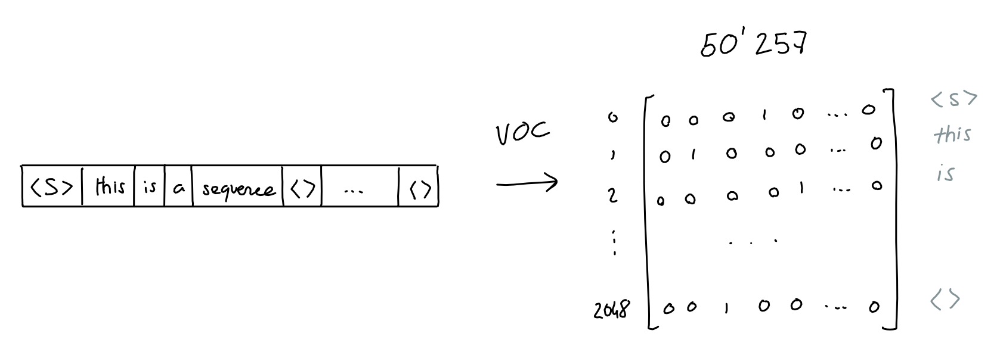

# LLM Infra 你需要知道的一切

# LLM Infra 你需要知道的一切

## GPT 3 

GPT 模型是 LLM 模型的起点，你如果说 Transformer 是，那也没错。既然我们要讨论 LLM Infra，那么我们需要知道我们的系统架构以及设计是给谁服务的。如果不了解模型架构，你对于后面介绍的 Infra 设计，比如推理阶段的 Prefill-Decode Disaggregation，Context Cache Migration，Traffic-Adaptive Request Routing 等，就会感到困惑。知其然，知其所以然。我们从 GPT3 开始，因为 GPT1 以及 GPT2 的参数量都太小了，GPT2 参数只有 1.5B, 而 GPT3 参数有 175B。如果对 Transformer 架构不熟悉，推荐这篇文章 [How Transformers Work](https://www.datacamp.com/tutorial/how-transformers-work);中文用户推荐知乎文章 [Transformer模型详解（图解最完整版）](https://zhuanlan.zhihu.com/p/338817680)。

  

首先确定 GPT3 的输入输出：
-  输入：一段文本，长度为 2048 个 token
-  输出：输入 2048个 token 下一个 token 的概率分布

这里的 token 是使用 Byte Pair Encoding (BPE) tokenizer 进行标记的。比如我使用 [OpenAI Tokenizer](https://platform.openai.com/tokenizer) 对 `I am xieydd, I love GPT3.` 进行标记后的结果如下, token ids 为 [40, 716, 2124, 494, 88, 1860, 11, 314, 1842, 402, 11571, 18, 13]：

  

### Encoding

Tokenizer 后的 token ids 还只是一串数字，并非向量。我们需要将其向量化，每一个 token 转换成 50257 维向量，向量 token id 位置为 1， 其他位置为 0。这样我们就得到了输入向量，长度为 2048 * 50257 = 102760896。

  

### Embedding

这个向量太稀疏了，我们需要将其降维，将其降维到 2048 * 12288。

  

### Positional Encoding

由于 Transformer 没有像 RNN 那样的递归机制，因此使用位置编码来提供有关序列中每个 token 的位置的信息。这使他们能够理解句子中每个单词的位置。Transformer 使用 sin 以及 cos 结合的方式，让 position encoding 可以编码任意长的句子。

  

### Attention

Vector 以及 Positional Encoding 相加后，得到了输入向量，接下来我们就要进行 Attention 了。这里将 2048 * 12288 的输入简化成 3*512。

  

  

  

  

> Image from https://dugas.ch/artificial_curiosity/GPT_architecture.html

- 输入向量，通过权重 Wq, Wk, Wv 得到 Query, Key, Value。
- Query 与 Key 进行点积，然后除以根号 d
- 进行 softmax 得到 attention score
- attention score 与 Value 进行点乘

### Sparse Attention

GPT3 并没有使用 Attention, 而是使用 Sparse Attention。sparse attention 除了相对距离不超过 k 以及相对距离为 k，2k，3k，... 的 token，其他所有 token 的注意力都设为 0，如下图所示：

  

好处有两点：
1. 减少注意力层的计算复杂度，节约显存和耗时，从而能够处理更长的输入序列；
2. 具有“局部紧密相关和远程稀疏相关”的特性，对于距离较近的上下文关注更多，对于距离较远的上下文关注较少；

### Multi-Head Attention

  

GPT3 将上述过程重复执行 96 次，有96个头,最后将输出在列行进行 concat。

### Feed Forward

Feed Forward 层是一个全连接层，输入是 Multi-Head Attention 的输出，输出是 2048 * 12288。

  

### Add & Norm

将进入 Multi-Head Attention 的前的输入和 Feed Forward 的输出相加，然后进行 Layer Normalization。

  

### Decoding

我们需要将 Add & Norm 的输出 2048 * 12288 转换回 2048 * 50257，这样才能知道 2048 个 token 下一个 token 的概率分布。我们复用了 Embedding 层的权重，将其转置后与 Add & Norm 的输出相乘，得到 2048 * 50257 的输出。随后经过 Softmax 得到概率分布, GPT3 取 topk 个 token 作为输出。

  

  

了解了 GPT3 的架构，我们就可以更好的理解 LLM Infra 的设计。下面我们进入如何训练大模型的话题。

## Training

大模型训练，这里我们主要参考 Andrej Karpathy 在 2023 年 MSBuild 的分享，分为以下四个阶段：
1. Pretraining
2. Supervised Fine-Tuning
3. Reward Modeling
4. Reforcement Learning

### Pretraining

Pretaining model 是大模型训练最消耗算力和数据的阶段，这个阶段的目标是让模型学习到语言的基本规律，比如语法，语义等。这个阶段的数据量很大，通常是 TB 级别的数据，通常是几周到数月。这个阶段的训练通常是无监督的，也就是说我们不需要标注数据。这个阶段的训练通常是在大规模的 GPU 集群上进行的，比如 OpenAI 的 GPT3 数千张 V100 上训练一个月天。

作为最消耗计算资源的预训练，我们在这个章节来分享 LLM 训练的一些技术，比如说分布式训练并行技术，训练优化技术。

#### Distributed Training

参考 OpenAI 的文章 [Techniques for training large neural networks
](https://openai.com/index/techniques-for-training-large-neural-networks/), 主要分为以下四个部分：
1. Data Parallelism
2. Model Parallelism
3. Pipeline Parallelism
4. Expert Parallelism

  

1. 这里不同颜色的块代表模型不同的层
2. 虚线代表分割到不同的 GPU
3. 箭头表示

##### Data Parallelism

#### Prepare Data

LLaMA 做 pretraining 时的训练数据如下所示： 

  

收集完原始数据后，需要进行数据处理，比如 Tokenization。

  

#### Model

我们看下 2020 年 GPT3 以及 2023 年 LLaMA 模型的一些参数对比：

  

解释下上图中的参数：
1. Vocabulary Size: 50257。这是指的是 Tokenizer 中词汇表的数量，也就是输入向量的维度。
2. Context Length: 2048。这是指的是生成模型在生成下一个 token 之前会看到的窗口的大小。
3. 虽然 GPT3 训练的参数量是 175B，而 LLaMA 只有65B 但是 LLaMA 训练的 token 1.5T > GPT3 300B。
4. 一些训练的超参数，比如 batch size, learning rate, 头数量以及模型层数等。

训练的输入如果是以下文本, 这里会由特殊 token `<|endoftext|>` 进行标记 
- Row 1: Here is an example document 1 showing some tokens.
- Row 2: Example document 2<|endoftext|> Example document 3<|endoftext|> Example document 
- Row 3: This is some random text just for example<|endoftext|> This
- Row 4: 1,2,3,4,5

Tokenization 后的结果如下：

  

这里 Batch 取 4，Context Length 取 10。其中每个单元格只能看见同行的单元格，绿色的是当前 highlight 的 token 所能看到的 context, 红色是它的目标。

#### Training

### Supervised Fine-Tuning

在这个阶段需要小的高质量的数据，一般是人类标注的数据，比如 prompt 以及相应理想的回复， 一般需要 10~100k。

这一阶段会将 Pretraining 的模型加载进来，然后在这个数据集上进行训练，得到的数据就是 SFT(Supervised Fine-Tuning) 模型。这时候你可以部署这个模型，提供类似 QA 的服务了。

### Reward Modeling

RLHF(Reward Learning from Human Feedback) 阶段分为两个部分，一个是 Reward Model，一个是 Reinforcement Learning。

Reward Model 会将数据收集变成比较的形式，举个例子

  

这里，人类需要输入相同的指令，在不同的输出中进行 Rank，得到 pair 数据集，大概 100k~1M。

训练中:

  

1. 每一行的蓝色 prompt 是一样的
2. 黄色是 SFT 模型输出
3. 绿色是 reward token，也就是 SFT 评价模型输出的质量，和人类评价的质量进行比较
4. 损失函数衡量 reward token 与人类标记的 ground truth 的一致性

### Reinforcement Learning

准备 10k~100k 的 Prompt 数据, Reward Model 对这些模型进行训练, 100 GPUs天级别。

  

1. 每一行的蓝色 prompt 是一样的
2. 黄色是 SFT 模型输出, 作为初始化值，作为 Reward Model 的训练数据
3. 绿色是 reward token，这个 token 会将 sampled token, 也就是黄色部分进行评价，如果高，则黄色部分 token 在后续的采样中会被采样的概率会增加。

PPO 算法就是 RLHF 模型, 为什么要使用 RLHF, 参见下图，RLHF 可以显著减少 predict 的熵，也就是预测的更加稳定。

  

## FineTuning

- Parameter Efficient FineTuning (PEFT), e.g. LoRA 

## Serving

### Serving Pattern

随着 Chat，Code Assistant 等 LLM 应用的蓬勃发展，LLM Serving 由单卡逐步拓展到多卡，甚至是多个实例。由此衍生出 Orchestration Pattern, 例如 prefill-decode disaggregation, context cache migration, traffic-adaptive request routing 等。

#### Prefill-Decode Disaggregation

#### Context Cache Migration

#### Traffic-Adaptive Request Routing

## 引用

[GPT3 Architecture](https://dugas.ch/artificial_curiosity/GPT_architecture.html)
[Microserving LLM engines](https://blog.mlc.ai/2025/01/07/microserving-llm-engines)
[State of GPT Andrej Karpathy](https://www.youtube.com/watch?v=bZQun8Y4L2A)
[LLM Action](https://github.com/liguodongiot/llm-action)

