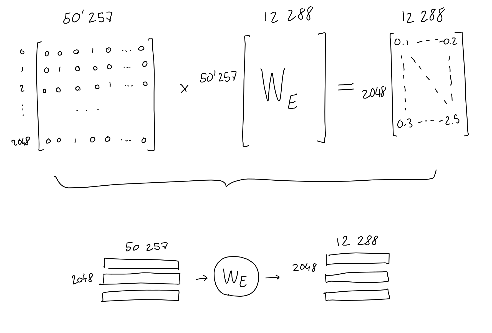
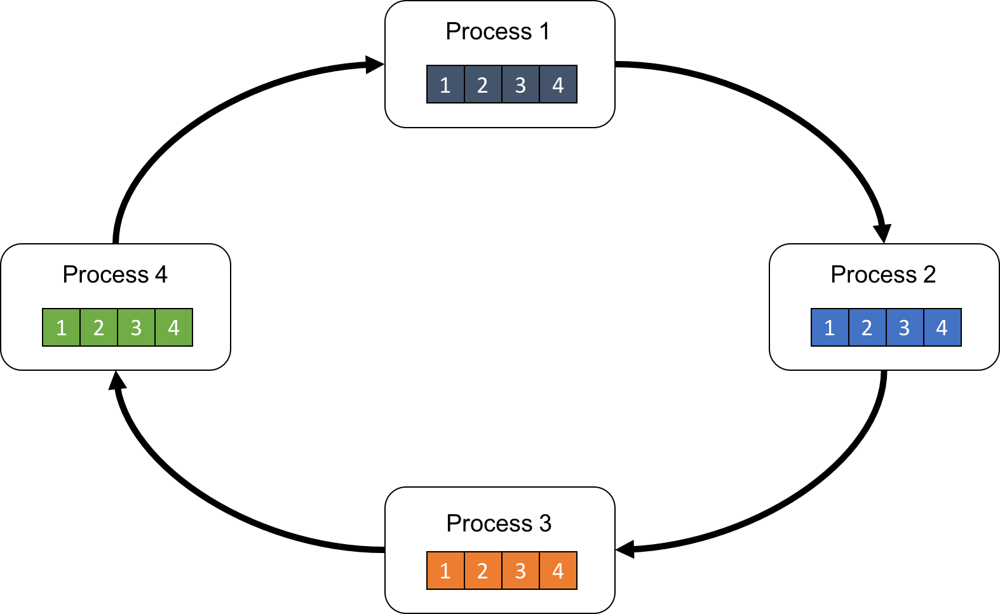
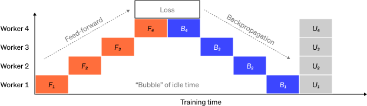

# LLM Infra 你需要知道的一切

# LLM Infra 你需要知道的一切

## GPT 3 

GPT 模型是 LLM 模型的起点，你如果说 Transformer 是，那也没错。既然我们要讨论 LLM Infra，那么我们需要知道我们的系统架构以及设计是给谁服务的。如果不了解模型架构，你对于后面介绍的 Infra 设计，比如推理阶段的 Prefill-Decode Disaggregation，Context Cache Migration，Traffic-Adaptive Request Routing 等，就会感到困惑。知其然，知其所以然。我们从 GPT3 开始，因为 GPT1 以及 GPT2 的参数量都太小了，GPT2 参数只有 1.5B, 而 GPT3 参数有 175B。如果对 Transformer 架构不熟悉，推荐这篇文章 [How Transformers Work](https://www.datacamp.com/tutorial/how-transformers-work);中文用户推荐知乎文章 [Transformer模型详解（图解最完整版）](https://zhuanlan.zhihu.com/p/338817680)。

  

首先确定 GPT3 的输入输出：
-  输入：一段文本，长度为 2048 个 token
-  输出：输入 2048个 token 下一个 token 的概率分布

这里的 token 是使用 Byte Pair Encoding (BPE) tokenizer 进行标记的。比如我使用 [OpenAI Tokenizer](https://platform.openai.com/tokenizer) 对 `I am xieydd, I love GPT3.` 进行标记后的结果如下, token ids 为 [40, 716, 2124, 494, 88, 1860, 11, 314, 1842, 402, 11571, 18, 13]：

  

### Encoding

Tokenizer 后的 token ids 还只是一串数字，并非向量。我们需要将其向量化，每一个 token 转换成 50257 维向量，向量 token id 位置为 1， 其他位置为 0。这样我们就得到了输入向量，长度为 2048 * 50257 = 102760896。

  

### Embedding

这个向量太稀疏了，我们需要将其降维，将其降维到 2048 * 12288。

  

### Positional Encoding

由于 Transformer 没有像 RNN 那样的递归机制，因此使用位置编码来提供有关序列中每个 token 的位置的信息。这使他们能够理解句子中每个单词的位置。Transformer 使用 sin 以及 cos 结合的方式，让 position encoding 可以编码任意长的句子。

  

### Attention

Vector 以及 Positional Encoding 相加后，得到了输入向量，接下来我们就要进行 Attention 了。这里将 2048 * 12288 的输入简化成 3*512。

  

  

  

  

> Image from https://dugas.ch/artificial_curiosity/GPT_architecture.html

- 输入向量，通过权重 Wq, Wk, Wv 得到 Query, Key, Value。
- Query 与 Key 进行点积，然后除以根号 d
- 进行 softmax 得到 attention score
- attention score 与 Value 进行点乘

### Sparse Attention

GPT3 并没有使用 Attention, 而是使用 Sparse Attention。sparse attention 除了相对距离不超过 k 以及相对距离为 k，2k，3k，... 的 token，其他所有 token 的注意力都设为 0，如下图所示：

  

好处有两点：
1. 减少注意力层的计算复杂度，节约显存和耗时，从而能够处理更长的输入序列；
2. 具有“局部紧密相关和远程稀疏相关”的特性，对于距离较近的上下文关注更多，对于距离较远的上下文关注较少；

### Multi-Head Attention

  

GPT3 将上述过程重复执行 96 次，有96个头,最后将输出在列行进行 concat。

### Feed Forward

Feed Forward 层是一个全连接层，输入是 Multi-Head Attention 的输出，输出是 2048 * 12288。

  

### Add & Norm

将进入 Multi-Head Attention 的前的输入和 Feed Forward 的输出相加，然后进行 Layer Normalization。

  

### Decoding

我们需要将 Add & Norm 的输出 2048 * 12288 转换回 2048 * 50257，这样才能知道 2048 个 token 下一个 token 的概率分布。我们复用了 Embedding 层的权重，将其转置后与 Add & Norm 的输出相乘，得到 2048 * 50257 的输出。随后经过 Softmax 得到概率分布, GPT3 取 topk 个 token 作为输出。

  

  

了解了 GPT3 的架构，我们就可以更好的理解 LLM Infra 的设计。下面我们进入如何训练大模型的话题。这里我们使用目前 SOTA 的开源模型 [DeepSeek-V3](https://github.com/deepseek-ai/DeepSeek-V3) 来进行讲解。

## Training

大模型训练，这里我们主要参考 Andrej Karpathy 在 2023 年 MSBuild 的分享，分为以下四个阶段：
1. Pretraining
2. Supervised Fine-Tuning
3. Reward Modeling
4. Reforcement Learning

在介绍这四个阶段之前，首先普及下 Hardware 的只是，因为大模型训练需要大量的计算资源，比如 GPU，此外数据的存储和网络通信都是需要考虑的。

### Hardware

#### GPU

一提到 GPU （Graphics Processing Unit）我们自然而然将其和 NVIDIA 挂钩，这个是有一定的道理的，因为 NVIDIA 的 GPU 在深度学习领域占有很大的市场份额。不过这个市场巨大，有 AMD 以及 Brodcom 的 Application-specific Integrated Circuits (ASICs) 芯片也在不断地吞噬市场份额。

虽然 GPU 带了个 Graph，但是在 AI 中我们更多的是使用 GPGPU (General-purpose computing on graphics processing units)。如果你不了解 GPU 的术语，推荐你看看 Modal 维护的 [GPU 术语表](https://modal.com/gpu-glossary)。GPU 相对于  CPU 

#### Network

#### Storage System

### Pretraining

Pretaining model 是大模型训练最消耗算力和数据的阶段，这个阶段的目标是让模型学习到语言的基本规律，比如语法，语义等。这个阶段的数据量很大，通常是 TB 级别的数据，通常是几周到数月。这个阶段的训练通常是无监督的，也就是说我们不需要标注数据。这个阶段的训练通常是在大规模的 GPU 集群上进行的，比如 OpenAI 的 GPT3 数千张 V100 上训练一个月天。

作为最消耗计算资源的预训练，我们在这个章节来分享 LLM 训练的一些技术，比如说分布式训练并行技术，训练优化技术。

目前 DeepSeek-V3 是在14.8T token 上进行训练的 MoE 架构，总参数为 671B，每个 token 激活 38B。

#### Distributed Training

参考 OpenAI 的文章 [Techniques for training large neural networks
](https://openai.com/index/techniques-for-training-large-neural-networks/), 主要分为以下四个部分：
1. Data Parallelism
2. Pipeline Parallelism
3. Tensor Parallelism
4. Expert Parallelism

  

1. 这里不同颜色的块代表模型不同的层
2. 虚线代表分割到不同的 GPU
3. 箭头表示模型的前向传播以及反向传播

##### Data Parallelism

Data Parallelism 将数据分成不同的 subset, 然后分发到不同的 GPU 上。对于每一个 GPU, 模型是完整的，所以每一个 GPU 都需要存储模型完整的参数。所以当 GPU 显存无法存储模型参数时，Data Parallelism 就不适用了，不过现在有些 Offload Memory 的技术或者 KV Cache 可以缓解这个问题。

正是因为每个 GPU 需要完整的参数，所以当更新的时候，需要保证工作线程（一般和 GPU 保持一致）的参数保持一致。这样在工作线程上需要引入阻塞通信：
1. 每个 worker 计算梯度
2. 平均每个 worker 的梯度
3. 每个 worker 更新参数 

当参数量越大，线程数越多，这个阻塞通信的开销就越大，当然可以使用异步的方式进行通信，但是这样可能会损害学习率，得不偿失，尤其对于 LLM 模型，投入资源大，不容有失。GPU 之间的通信通过 NCCL (NVIDIA Collective Communication Library) 这个库来实现。上述通信过程通常的叫法是 AllReduce 如下图所示：

  

我们注意到如果 AllReduce 在一个单独的进程进行处理，那么这个进程需要 Gather All 以及 Scatter All, 这样单进程的通信开销和节点数以及参数量成正比。为了消除节点数以及参数量带来的阻塞等待浪费，我们可以使用 Ring AllReduce，如下图所示：

  

首先将 N 个 worker 构建一个 ring, 每个进程将数据划分成 N 个 chunk。

  

第 N 个 worker 将第 N 个 chunk 发送给第 worker[N+1]，同时从 worker[N-1] 接受 chunk。

  

第 N 个 worker 将接受到的 N-1 chunk 和自己的 N-1 chunk 进行 reduce，然后发送到 worker[N+1]。

  

重复接受，reduce，发送的过程，重复 N-1 次，这样每个 worker 获得结果的一部分。最后再进行一轮的 Send 操作而不做 reduce 操作，这样每个 worker 就获得了最终的结果。

##### Pipeline Parallelism (Model Parallelism)

Pipeline Parallelism 将模型分成不同的 stage, 然后分发到不同的 GPU 上。对于大模型来说，比如 LLaMA 65B, 如果参数是 FP32 那么总显存需要 260GB 但是一般训练都采用半精度也就是 FP16，那么也需要 130GB 显存，目前最前进的 H200 显存也就是 80GB。目前来自 DeepSeek 团队训练的 [DeepSeek V3](https://huggingface.co/deepseek-ai/DeepSeek-V3) 已经首次在超大规模模型上验证了FP8训练的可行性和有效性。但是 DeepSeek V3 是 MOE (Mixtures of Experts) 模型，参数达到 671B, 这个我们后面再聊。

  

1. 模型每一层的输入和输出都有顺序，F 代表 Forward, B 代表 Backward, U 代表 Update
2. 每个 worker (GPU) 在同一时间只负责处理一个 stage
3. 时间序列上，资源利用出现大量的气泡

为了优化这个问题，我们可以将刚才 ring allreduce 的思想拿过来，也就是将一个 batch 数据进行切分，将计算时间和等待时间 overlap，如下图所示：

  

上图为 GPipe 的示意图，GPipe 将模型 layer 的 chunk 数据的激活值连续传递给下一个 worker，也连续进行向后传递。然后同步聚合梯度，更新参数。

  

而 PipeDream 则让 worker 交替处理向前和向后传递。相对 GPiPe，PipeDream 有更好的资源利用率，但是需要更多的通信开销。

##### Tensor Parallelism

Tensor Parallelism 将模型的 operator 分成不同的 subset, 然后分发到不同的 GPU 上, 比如说矩阵乘法。Pipeline parallelism 是将模型的层分到不同的 GPU, 而 Tensor Parallelism 是将模型层内的 operator 分到不同的 GPU。对于现代模型比如 Transformer, 将激活值和大的权重进行点积计算是计算的瓶颈。比如 [MegatronLM](https://nv-adlr.github.io/MegatronLM) 在 Transformer 的Self-Attention 和 MLP 层进行了并行化矩阵乘法。[PTD-P](https://arxiv.org/abs/2104.04473) 使用tensor，pipeline，以及data parallelism， pipeline scheduler 为每个设备分配多个非连续层，以网络通信为代价减少气泡开销。

##### Expert Parallelism

Mixture-of-Experts (MoE) 是一种将模型每一层的某些部分放在同一个 GPU 上执行，这意味着你可以通过门控制器控制模型中哪些部分会应用到本次输入和输出。每一组门控制的一组参数都是一个 Expert，不同的 Expert 在不同的 GPU 上。

  

很明显 MoE 架构可以显著的提升模型的大小，这来源于一个经验，在有限的计算资源预算下，用更少的训练步数训练一个更大的模型，往往比用更多的步数训练一个较小的模型效果更佳。特别是在预训练阶段，与稠密模型相比，混合专家模型通常能够更快地达到相同的质量水平。MoE 是基于 Transformer 架构的，由下面两个部分组成：
1. 稀疏 MoE 层：MoE 层有若干个专家，如下图为 8 个专家，这些专家可以是 FFN 层，也可以是 MoE 层，像俄罗斯套娃。
2. 门控网络或路由：这个路由决定 token 会被发送到哪个专家，路由器的参数会在训练中进行训练。

  

上面讲到 MoE 的优点，但是 MoE 也有一些缺点：
1. 微调过程中泛化能力不足，容易过拟合
2. 推理过程中需要加载所有的参数到内存，即使只有一个专家被激活，比如  Mixtral 8x7B ，VRAM 需要放的下 47B 的参数，这里不是 56B 是因为 MoE 只有 FFN 是独立的，其他层会共享参数。
3. Token 被路由到不同的专家，导致批量大小分布不均，导致计算资源浪费。

对于门控网络，除了最典型的带有 Softmax 的网络，还有其他网络，比如包括带噪声的 TopK 门控 (Noisy Top-K Gating)，引入可调节的随机噪声并保留前 k 值。
- 随机噪声是为了让专家间的负载更加均衡，在训练过程中才避免只有受欢迎的专家得到训练，在 transformers 库中，可以通过 aux_loss 参数来控制辅助损失。
- topk 可以选择性的保留前 k 个值，加速训练和推理

列举两个典型的 MoE 模型或者说方法：
1. Gshard

  

为了保证负载平衡和训练效率，Gshard 除了使用上述的辅助损失外，还进行了以下的优化：
- 随机路由: 在 Top-2 设置中，我们始终选择排名最高的专家，但第二个专家是根据其权重比例随机选择的。
- 定义一个专家能处理多少令牌。如果两个专家的容量都达到上限，令牌就会溢出，并通过残差连接传递到下一层，或在某些情况下被完全丢弃。

2. Switch Transformer

Switch Transformer 使用接受两个输入，每个输入4个专家，而并非单输入，至少两个专家的设定。这样做的优势是：
1. 减少门控网络 (路由) 计算负担
2. 每个专家的输入 batch 至少可以减半
3. 降低通信成本，保持模型质量

于此同时 Switch Transformer 也对专家容量进行了研究，通过大于 1 的容量因子为 token分配不均匀时提供缓冲。提高容量因子 (Capacity Factor, CF) 可以增强模型的性能，但这也意味着更高的通信成本和对保存激活值的显存的需求。 
在训练期间，对于每个 Switch 层的辅助损失被添加到总模型损失中。这种损失鼓励均匀路由，并可以使用超参数进行加权。
Switch Transformer 还探索了混合精度，也就是专家使用原始精度，其他部分使用 Bfloat16 精度，在保证训练稳定性的同时，增加了训练速度。

ST-MoE 的研究者们发现，编码器中不同的专家倾向于专注于特定类型的令牌或浅层概念。例如，某些专家可能专门处理标点符号，而其他专家则专注于专有名词等。与此相反，解码器中的专家通常具有较低的专业化程度。

训练 MoE 模型有哪些 tricks:
1. 稀疏模型更易于出现过拟合现象，因此在处理这些模型时，尝试更强的内部正则化措施是有益的，比如使用更高比例的 dropout。例如，我们可以为稠密层设定一个较低的 dropout 率，而为稀疏层设置一个更高的 dropout 率，以此来优化模型性能；
2. MoE 模型在小任务比如 SuperGLUE 容易过拟合，不如在大任务比如 TriviaQA 效果好；
3. 冻结 MoE 参数进行微调，可以显著加速并且对模型效果影响很小；
4. MoE 适合更小的 batch 和更高的学习率；
5. 在稀疏模型上进行微调效果好用稠密模型。

对于稀疏模型和稠密模型如何选择呢？
1. 稀疏混合专家模型 (MoE) 适用于拥有多台机器且要求高吞吐量的场景。在固定的预训练计算资源下，稀疏模型往往能够实现更优的效果。相反，在显存较少且吞吐量要求不高的场景，稠密模型则是更合适的选择。
2. 直接比较稀疏模型和稠密模型的参数数量是不恰当的，因为这两类模型基于的概念和参数量的计算方法完全不同。

  

我们刚才在讲分布式训练的优化手段，讲到了 Expert Parallelism，从而引申到 MoE 模型，那么为什么 MoE 模型需要 Expert Parallelism 呢？
1. 在 Expert Parallelism 中，专家被放置在不同的设备上，每个设备处理不同批次的训练样本；
2. 当单个专家参数可以在一个设备上时候，采用数据并行和专家并行的方式训练
3. 如果单个专家模型不能再一个设备上，需要加入模型并行，将单个专家模型分布到不同的设备上，同时配合数据进行并行训练加速

部署专家模型优化方式：
1. 对专家模型进行蒸馏
2. 路由器被修改为将整个句子或任务直接路由到一个专家。这样做可以提取出一个用于服务的子网络，有助于简化模型的结构。
3. 合并各个专家的权重，在推理时减少了所需的参数数量

#### Prepare Data

LLaMA 做 pretraining 时的训练数据如下所示： 

  

收集完原始数据后，需要进行数据处理，比如 Tokenization。

  

#### Model

我们看下 2020 年 GPT3 以及 2023 年 LLaMA 模型的一些参数对比：

  

解释下上图中的参数：
1. Vocabulary Size: 50257。这是指的是 Tokenizer 中词汇表的数量，也就是输入向量的维度。
2. Context Length: 2048。这是指的是生成模型在生成下一个 token 之前会看到的窗口的大小。
3. 虽然 GPT3 训练的参数量是 175B，而 LLaMA 只有65B 但是 LLaMA 训练的 token 1.5T > GPT3 300B。
4. 一些训练的超参数，比如 batch size, learning rate, 头数量以及模型层数等。

训练的输入如果是以下文本, 这里会由特殊 token `<|endoftext|>` 进行标记 
- Row 1: Here is an example document 1 showing some tokens.
- Row 2: Example document 2<|endoftext|> Example document 3<|endoftext|> Example document 
- Row 3: This is some random text just for example<|endoftext|> This
- Row 4: 1,2,3,4,5

Tokenization 后的结果如下：

  

这里 Batch 取 4，Context Length 取 10。其中每个单元格只能看见同行的单元格，绿色的是当前 highlight 的 token 所能看到的 context, 红色是它的目标。

#### Training

### Supervised Fine-Tuning

在这个阶段需要小的高质量的数据，一般是人类标注的数据，比如 prompt 以及相应理想的回复， 一般需要 10~100k。

这一阶段会将 Pretraining 的模型加载进来，然后在这个数据集上进行训练，得到的数据就是 SFT(Supervised Fine-Tuning) 模型。这时候你可以部署这个模型，提供类似 QA 的服务了。

### Reward Modeling

RLHF(Reward Learning from Human Feedback) 阶段分为两个部分，一个是 Reward Model，一个是 Reinforcement Learning。

Reward Model 会将数据收集变成比较的形式，举个例子

  

这里，人类需要输入相同的指令，在不同的输出中进行 Rank，得到 pair 数据集，大概 100k~1M。

训练中:

  

1. 每一行的蓝色 prompt 是一样的
2. 黄色是 SFT 模型输出
3. 绿色是 reward token，也就是 SFT 评价模型输出的质量，和人类评价的质量进行比较
4. 损失函数衡量 reward token 与人类标记的 ground truth 的一致性

### Reinforcement Learning

准备 10k~100k 的 Prompt 数据, Reward Model 对这些模型进行训练, 100 GPUs天级别。

  

1. 每一行的蓝色 prompt 是一样的
2. 黄色是 SFT 模型输出, 作为初始化值，作为 Reward Model 的训练数据
3. 绿色是 reward token，这个 token 会将 sampled token, 也就是黄色部分进行评价，如果高，则黄色部分 token 在后续的采样中会被采样的概率会增加。

PPO 算法就是 RLHF 模型, 为什么要使用 RLHF, 参见下图，RLHF 可以显著减少 predict 的熵，也就是预测的更加稳定。

  

## Serving

### Serving Pattern

随着 Chat，Code Assistant 等 LLM 应用的蓬勃发展，LLM Serving 由单卡逐步拓展到多卡，甚至是多个实例。由此衍生出 Orchestration Pattern, 例如 prefill-decode disaggregation, context cache migration, traffic-adaptive request routing 等。

#### Prefill-Decode Disaggregation

#### Context Cache Migration

#### Traffic-Adaptive Request Routing

## 引用

1. [GPT3 Architecture](https://dugas.ch/artificial_curiosity/GPT_architecture.html)
2. [Microserving LLM engines](https://blog.mlc.ai/2025/01/07/microserving-llm-engines)
3. [State of GPT Andrej Karpathy](https://www.youtube.com/watch?v=bZQun8Y4L2A)
4. [LLM Action](https://github.com/liguodongiot/llm-action)
5. [MOE Architecture](https://huggingface.co/blog/moe)

