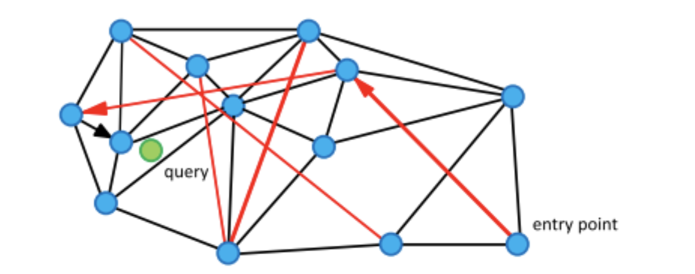

# 向量数据库中的门门道道


加入 Tensorchord 已经一年有余，一直也没有时间静下心来写一些文章。主要是有了彤彤女儿后，事情多了很多。中间也经历过业务从 Serverless 模型推理 [Modelz](https://modelz.ai/) pivot 到向量搜索领域 [PGVecto.rs](https://pgvecto.rs/) 的过程。Pivot 的经历或许可以在之后的文章中和大家分享，感兴趣的也可以直接[联系](../../about/index.zh-cn.md)我。最近半年一直在开发 [PGVecto.rs Cloud](https://cloud.pgvecto.rs/), 所以在这里边学边总结向量数据库中的门门道道。

## 什么是向量

向量在物理，数学，以及计算机科学等领域的含义都有所不同。这里的向量主要指的是计算机科学中的向量，也就是一组有序的数值。在计算机科学中，向量通常用来表示数据，比如在机器学习中，我们通常会将一张图片转换成一个向量，或者将一段文字 tokenizer 之后转换成一个向量，然后再进行训练。在向量数据库中，我们通常会将一张图片，一段文本，或者一段音频通过 embedding 模型转换成一个向量，然后再进行存储和检索。下面是一个简单的例子，我们通过 `all-MiniLM-L6-v2` 模型将一段文本转换成一个向量。`all-MiniLM-L6-v2` 将句子和段落映射到 384 维 dense vector，并可用于聚类或语义搜索等任务。

```python
from sentence_transformers import SentenceTransformer

# 初始化模型
model = SentenceTransformer('all-MiniLM-L6-v2')

# 要嵌入的文本示例
sentences = [
    "Hugging Face is creating a tool that democratizes AI.",
    "I love natural language processing.",
    "Transformers are state-of-the-art models for NLP tasks."
]

# 生成嵌入
embeddings = model.encode(sentences)

# 打印嵌入
for sentence, embedding in zip(sentences, embeddings):
    print(f"Sentence: {sentence}")
    print(f"Embedding: {embedding}\n")
```

总结一下向量其实是真实世界的实体和计算机世界的桥梁, 计算机通过向量来理解和处理真实世界的数据。

## 什么是向量数据库

世界本没有向量数据库，只是向量多了，就成了向量数据库，开个玩笑hh。这里我给个简单的定义：能够索引并存储 vector，以实现快速检索和相似性搜索功能的数据库。网络上很多人将向量数据库定义为专注于处理向量数据的数据库，这个定义是不准确的。准确的说向量与向量搜索是一种新的数据类型和查询处理方法，和传统数据库的类似和索引方法并无本质区别。

## 什么是向量搜索

向量搜索也叫向量检索，是一种 Information Retrieval 的技术，用于在高维向量空间中查找与给定查询向量最相似的向量。为了衡量两个向量之间的相似性，我们通常会使用余弦相似度，欧氏距离，曼哈顿距离等。为了加速向量搜索，我们通常会使用索引结构，比如 KD-Tree，IVF(Inverted File Index)，HNSW(Hierarchical Navigable Small World)等。向量搜索在很多领域都有应用，比如在推荐系统中，我们可以使用向量搜索来查找与用户历史行为最相似的商品，然后推荐给用户；在图像检索中，我们可以使用向量搜索来查找与给定图片最相似的图片；在 RAG（Retrieval Augmented Generation）中，我们可以使用向量搜索来查找与给定问题最相似的文本，增强大模型的 Context 从而提高生成答案的质量。

### 向量搜索应用场景

#### 推荐系统

如 Qdrant 关于 [Video Content-based Recommendation](https://qdrant.tech/blog/vector-search-vector-recommendation/) 的 On-premise 案例，通过 multilingual universal sentence encoder 来对上传视频时候的脚本进行嵌入。这里不是简单的对视频进行抽帧，更多的信息来自于上传时候的视频标题，描述，自动检测标签以及通过 whisper 语音识别的内容。所以目前遇到的问题是如果视频是无音频，被迫使用标题以及描述进行推荐，这样对于审核团队来说是一个很大的挑战。这里提到了推荐领域的 call start issues, 也就是用户在刚开始使用的时候，推荐系统的推荐质量不高，这个时候用户体验会很差。在非即时更新的协作推荐器以及元数据推荐器的基础上，增加基于内容的推荐器，可以大大优化 call start issues。

#### 图像检索

[immich](https://github.com/immich-app/immich) 是一个高性能的开源 self-hosted 图像以及视频管理解决方案。试想当你把你所有的视频和图片都上传到 immich 之后，你很难在很短的时间内找到你想要的图片或者视频。这个时候就需要一个高效的图像检索系统 [smart search](https://immich.app/docs/features/smart-search)，通过向量搜索技术，你可以通过文本描述以及额外的过滤器（标签，日期等）来快速精准的找到你想要的图片或者视频。


> 图片来自于 [immich](https://immich.app/docs/features/smart-search)

#### RAG

RAG（Retrieval Augmented Generation）主要解决在 LLM 应用中的几个问题：
1. LLM 训练模型的数据不是即时的，换句话说是静态的数据，获取最新数据重新进行训练的成本太大。
2. LLM 缺乏特定领域的知识，因为 LLM 的训练语料大都是网络上通用的数据集。而在比如金融，医疗，法律等领域，私域中的数据或许是最重要的，缺乏领域内数据会让 LLM 出现幻觉问题。
3. LLM 的黑匣子问题，我们无法知道 LLM 是如何生成答案的，其答案的来源来自何处。

这里借用 Paul lusztin 和 Aurimas Griciunas 的两张图来解释 RAG 的工作原理：


1. 获取金融新闻的流式即时数据，以及历史数据
2. 将数据进行 chunking 转换成 embedding 模型的输入，然后将 embedding 存储到向量数据库中
3. 用户提问
4. 通过向量搜索找到最相似的新闻 chunks，然后将用户历史的 chat 信息和新闻 chunks 进行 Prompt composition
5. 输入到 LLM 中生成答案。
6. 将答案返回给用户
7. 将新的 chat 信息存储到用户历史数据中


1. 私域中的数据，例如 Notion, Jira,本地 pdf 文件等等进场 chunking 转换成 embedding 模型的输入
2. 将 chunk 输入到 embedding 模型中，然后将 embedding 存储到向量数据库中
3. Vector Database 构建 Index 
4. 用户提问, 输入到 embedding 模型
5. embedding 输出 query 的 embedding vector
6. 将 5 中的 vector 作为 Query vector 输入到向量数据库中
7. 向量数据库通过 ANNs（Approximate Nearest Neighbors Search）找到最相似的 chunks
8. 将搜索到的 chunks 和 query 构建 Prompt
9. 输入到 LLM 中生成答案
### 相似度指标

余弦相似度是一种用于衡量两个向量之间的相似性的方法，它是通过计算两个向量之间的夹角来衡量的。余弦相似度的取值范围是[-1, 1]，其中1表示两个向量之间的夹角为0度，表示两个向量完全相同；-1表示两个向量之间的夹角为180度，表示两个向量完全相反；0表示两个向量之间的夹角为90度，表示两个向量之间没有相似性。计算公式如下：


这个公式计算了向量 𝐴 和 𝐵 之间的夹角余弦值。

欧氏距离是一种用于衡量两个向量之间的相似性的方法，它是通过计算两个向量之间的距离来衡量的。欧氏距离的取值范围是[0, ∞]，其中0表示两个向量完全相同， 数值越大则表示两个向量之间的差异越大。计算公式如下：


这个公式计算了向量 𝐴 和 𝐵 之间的欧氏距离, 有些直接不开根号其只是数值不同，并无本质区别。

负内积（Negative inner product），它是通过计算两个向量之间的内积来衡量的。数值越大则表示两个向量之间的相似性越高。计算公式如下：


曼哈顿距离（taxicab distance），它是通过计算两个向量之间的距离来衡量的。曼哈顿距离的取值范围是[0, ∞]，其中0表示两个向量完全相同， 数值越大则表示两个向量之间的差异越大。计算公式如下：


### 向量搜索算法

直觉上，我们可以通过遍历所有的向量来找到与给定查询向量最相似的向量，但是这种方法的时间复杂度是 O(n)，当向量的数量很大时，这种方法是不可行的。为了加速向量搜索，我们通常会使用索引结构，比如 IVF(Inverted File Index)，HNSW(Hierarchical Navigable Small World)等。通过 ANNs (Approximate Nearest Neighbors Search) 算法，我们可以在更低的时间复杂度，比如 O(log(n))，找到与给定查询向量最相似的向量。

#### LSH (Locality Sensitive Hashing)

局部敏感哈希 (LSH) 的工作原理是通过哈希函数处理每个向量，将向量分组到存储桶中，从而最大化哈希冲突，而不是像通常的哈希函数那样最小化冲突。

这里引用 Pinecone 的一张图


LSH 的具体细节如下图所示：


1. Shingling：使用 k-shingling 以及 one-hot encoding 将文本转换成稀疏向量
    - k-shingling 的意思是以窗口大小为 k 的滑动窗口，在文本中提取 k 个连续的字符
    - one-shot encoding 的意思是，将 k-shingling 的结果和词汇表进行比较，如果存在则在词汇表表示为1，不存在则为0


2.  后使用 MinHash 创建“签名”
    - 创建 [1...len(voc)+1] 的随机排列
    - 随机排列中从上到下的值作为 index ，如果原始稀疏 vector 的 index-1 位置为1则取随机排列的 index-1 位置数为签名值
    - 重复 n 次得到 n 维度稠密向量

3. Band and Hash 
    - 将 n 维度的签名向量分成 b 组，每组 r 个
    - 对每组进行 hash，得到 b 个 hash 值
    - 如果两个向量的 hash 值相同，则将这两个向量放到同一个桶中
    - 如果在同一个桶中，则认为其为候选对


这里随着 b 的增大返回更多的候选对，这自然会导致更多的误报


这意味着随着纬度的增加，误报的可能性越大，而且维数增大后需要维护更多的 hash 桶，存储的开销也会增大。所以 LSH 更适合低维度的向量搜索，不是目前的主流向量搜索算法。

#### IVF（Inverted File Index）

倒排索引算法是一个简单、易懂而且非常容易实现的算法，而且有着不错的搜索速度，但是搜索的精度较 HNSW 较差些，但是内存消耗相对 HNSW 更少。

构建 IVF 索引的核心分为两个步骤：
1. 通过聚类算法将向量分成 nlist 个簇
2. 将向量分配到对应的簇中

搜索时候，设定需要需要搜索的单元格数量 nprobe


这里参数的影响是：
- 增大 nlist 会降低构建索引的速度，因为在聚类过程中向量需要跟更多的中心点进行计算；同时会降低搜索时间，因为对应中心点的向量更少了，做 knn 的时候更快。
- 增大 nprobe 会提高召回率但是会降低搜索速度，因为需要搜索更多的单元格。


#### HNSW (Hierarchical Navigable Small World)

HNSW 结合了 NSW 以及 Skip List 的优点，是一种高效的向量搜索算法。HNSW 的核心思想是通过构建一个多层的图，每一层都是一个小世界，通过在每一层中搜索最近的节点，然后在下一层中搜索最近的节点，最终找到与给定查询向量最相似的向量。

NSW 是建立在一个理论的基础上，NSW 上的点到任意点的距离都是有限的，而且是通过很少的几次跳跃就能找到的。


NSW 的构造过程：
1. 随机选择一个点作为插入点
2. 查找与插入点最近的 m 个点
3. 将插入点与 m 个点相连

这里的随机性会让前期的图中长连接线增多，加速搜索，可以理解成“高速公路”，下图中的红色线就是长连接线：



NSW 的搜索过程如下，这里借用知乎网友“工牌厂程序猿”的一张图：

1. 初始化三个集合，分别是 visited，candidate，result（定长）；随机选择初始点进入，并加入 visited 以及 candidate 集合, candidate 保存和 query 点的距离
2. 寻找初始点的 n 最近邻点，加入到 visited 集合，注意如果友点在 visited 集合中则废弃，，对 n 个近邻点并行计算和 query 的距离，进行升序排序（由近到远）加入 candidate 集合
3. 寻找 candidate 集合中的 n 个近邻点，加入 visited 集合，如果已经存在 visited 集合中废弃；这里查询的是 C 点，只有 D 点没访问过，因为 D 点距离 query 点距离小于 C 到 query 点距离，所以 result 中将 C 换成 D 点，candidate 中将 C 换成 D 点
4. 重复 3 步骤，寻找 D 的 n 哥最近邻，加入 visited 集合，如果已经存在 visited 集合中废弃；这里查询的是 E 点和 G 点，因为 E 点距离 query 点距离小于 result 集合中的最大距离，所以 result 中将 H 换成 E 点，candidate 中将 E 点剔除
5. 重复 3 candidate 集合中距离 query 最小距离的点 H 的距离比  result 集合中距离 query 最大的点 E 的距离还大，则停止查询 

Skip List 是一种高效的数据结构，可以在 O(log(n)) 的时间复杂度内找到与给定查询向量最相似的向量。Skip List 的核心思想是通过构建一个多层的链表，每一层都是一个有序的链表，通过在每一层中搜索最近的节点，然后在下一层中搜索最近的节点，最终找到与给定查询向量最相似的向量。


这里需要主要 HNSW 的几个点：
1. 注意这里需要控制 HNSW 每一层的点最大连接数 Max, 在随机（越底层权重越大）插入节点时，如果有邻居节点 N 的连接数大于 Max，则对 N 进行 KNN 搜索重新与新的邻居建立连接。
2. 启发式选边策略：在每一层搜索与插入点最邻近的 M 个节点的时候，它是先召回了 efConstruction 个，然后再选择出 M 个(efConstruction >= M)，选择 M 的过程可以直接选择 Top-M 但是可能会降低整体的连通性，“工牌厂程序猿” 的文章具体列举了这个 case:

这里的 efConstruction 是 4，M 是 2，如果直接选择 Top-M 的话，一定会选择 A 和 B, 这样 ABQ 和 CD 的连通性就降低了，这里在选择 A 后寻找第二个最近邻的时候检测 QA 和 AB 距离，如果 QA > AB 则再寻找下一个最近邻，知道大于 QA 为止,这里找到 C 点时 AC > AQ。

HNSW 由于检索过程中涉及平均单条查询会产生数百个读磁盘操作，需要不停的寻找下一个随机点，放到 SSD 会导致极高的时延，所以是全内存的。

#### NSG (Navigating Spreading-out Graph)

NSG 围绕图的连通性、减少出度，缩短搜索路径以及图的大小等方面进行了优化， 提出新的图结构 Monotonic Relative Neighborhood Graph (MRNG)。

具体流程如下：
- 构建 K-nearest-neighbor-graph (KNNG) 作为构图基准
- 随机选择一个点作为 Navigation Point，后续所有新插入的节点在选边时都会将Navigation Point加入候选集合
- 在建图过程中，逐渐会将子图都和 Navigation point 相连接，这样其他的节点只需保持很少的边即可，从而减少了图的大小
- 每次搜索从 Navigation Point 出发能够指向具体的子图，从而减少无效搜索，获得更好搜索性能。

NSG 选边跟 HNSW 选择最小边策略不同。以点 r 为例，当 r 与 p 建立连接时，以 r 和 p 为圆心，r 和 p 的距离为半径，分别做圆，如果两个圆的交集内没有其他与 p 相连接的点，则 r 与 p 相连。在连接点 s 时，由于以 s 和 p 距离为半径的交集圆内，已有点 r 与 p 相连，所以 s 和 p 不相连。下图中最终与点 p 相连的点只有r, t 和 q：


#### DiskANN

DiskANN 系列有三篇文章，DiskANN，FreshDiskANN，FilterDiskANN， 从本质上是对 HNSW 算法的优化。

DiskANN 通过引入 SSD 友好型的图算法 Vamana,最小化磁盘操作。


这里总结下，内存占用上 HNSW 明显大于 IVF，LSH 以及 Flat(KNN)，召回率以及搜索速度上 HNSW 优于 IVF，LSH。所以在选择向量搜索算法的时候需要根据自己的需求来选择。

### 向量搜索算法优化

通过减少 Vector 大小，或者通过降维让搜索更快，这里列举了一些常见的向量搜索算法优化方法。

#### PQ（Product Quantization）

#### SQ（Scalar Quantization）

## 常见的向量数据库极其优劣

以下列举了一些常见的向量数据库，以及他们的优劣势。

### [Milvus](https://milvus.io/)

### [Pinecone](https://www.pinecone.io/)
### [Qdrant](https://qdrant.tech/)
### [Pgvector](https://github.com/pgvector/pgvector)
### [Pgvecto.rs](https://pgvecto.rs/)


## 优秀的向量搜索库以及向量数据库开源项目

## 向量数据库商业化你需要知道什么

## 引用

非常感谢 Pinecone 的文章，让我对向量数据库有了更深的了解。

- https://www.pinecone.io/learn/series/faiss/vector-indexes/
- https://www.pinecone.io/learn/series/faiss/locality-sensitive-hashing/
- https://zhuanlan.zhihu.com/p/379372268
- https://songlinlife.github.io/2022/%E6%95%B0%E6%8D%AE%E5%BA%93/%E8%AE%BA%E6%96%87%E9%98%85%E8%AF%BB%EF%BC%9ANSG/
- https://www.xiemingzhao.com/posts/hnswAlgo.html
- https://whenever5225.github.io/2020/05/11/hnsw-heuristic/

