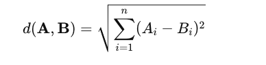

# 向量数据库中的门门道道


加入 [Tensorchord](https://tensorchord.ai) 已经一年有余，一直也没有时间静下心来写一些文章。主要是有了彤彤女儿后，事情多了很多。中间也经历过业务从 Serverless 模型推理 [Modelz](https://modelz.ai/) pivot 到向量搜索领域 [VectorChord](https://vectorchord.ai/) 的过程。Pivot 的经历或许可以在之后的文章中和大家分享，感兴趣的也可以直接[联系](../../about/index.zh-cn.md)我。最近半年一直在开发 [VectorChord Cloud](https://cloud.vectorchord.ai/), 所以在这里边学边总结向量数据库中的门门道道。

## 1. 什么是向量

向量在物理，数学，以及计算机科学等领域的含义都有所不同。这里的向量主要指的是计算机科学中的向量，也就是一组有序的数值。在计算机科学中，向量通常用来表示数据，比如在机器学习中，我们通常会将一张图片转换成一个向量，或者将一段文字 tokenizer 之后转换成一个向量，然后再进行训练。在向量数据库中，我们通常会将一张图片，一段文本，或者一段音频通过 embedding 模型转换成一个向量，然后再进行存储和检索。下面是一个简单的例子，我们通过 `all-MiniLM-L6-v2` 模型将一段文本转换成一个向量。`all-MiniLM-L6-v2` 将句子和段落映射到 384 维 dense vector，并可用于聚类或语义搜索等任务。

```python
from sentence_transformers import SentenceTransformer

# 初始化模型
model = SentenceTransformer('all-MiniLM-L6-v2')

# 要嵌入的文本示例
sentences = [
    "Hugging Face is creating a tool that democratizes AI.",
    "I love natural language processing.",
    "Transformers are state-of-the-art models for NLP tasks."
]

# 生成嵌入
embeddings = model.encode(sentences)

# 打印嵌入
for sentence, embedding in zip(sentences, embeddings):
    print(f"Sentence: {sentence}")
    print(f"Embedding: {embedding}\n")
```

总结一下,向量其实是真实世界的实体和计算机世界的桥梁, 计算机通过向量来理解和处理真实世界的数据。

## 2. 什么是向量数据库

世界本没有向量数据库，只是向量多了，就成了向量数据库，开个玩笑hh。这里我给个简单的定义：能够索引并存储 vector，以实现快速检索和相似性搜索功能的数据库。网络上很多人将向量数据库定义为专注于处理向量数据的数据库，这个定义是不准确的。准确的说向量与向量搜索是一种新的数据类型和查询处理方法，和传统数据库的类似和索引方法并无本质区别。

## 3. 什么是向量搜索

向量搜索也叫向量检索，是一种 Information Retrieval 的技术，用于在高维向量空间中查找与给定查询向量最相似的向量。为了衡量两个向量之间的相似性，我们通常会使用余弦相似度，欧氏距离，曼哈顿距离等。为了加速向量搜索，我们通常会使用索引结构，比如 KD-Tree，IVF(Inverted File Index)，HNSW(Hierarchical Navigable Small World)等。向量搜索在很多领域都有应用，比如在推荐系统中，我们可以使用向量搜索来查找与用户历史行为最相似的商品，然后推荐给用户；在图像检索中，我们可以使用向量搜索来查找与给定图片最相似的图片；在 RAG（Retrieval Augmented Generation）中，我们可以使用向量搜索来查找与给定问题最相似的文本，增强大模型的 Context 从而提高生成答案的质量。

### 3.1 向量搜索应用场景

#### 3.1.1 推荐系统

如 Qdrant 关于 [Video Content-based Recommendation](https://qdrant.tech/blog/vector-search-vector-recommendation/) 的 On-premise 案例，通过 multilingual universal sentence encoder 来对上传视频时候的脚本进行嵌入。这里不是简单的对视频进行抽帧，更多的信息来自于上传时候的视频标题，描述，自动检测标签以及通过 whisper 语音识别的内容。所以目前遇到的问题是如果视频是无音频，被迫使用标题以及描述进行推荐，这样对于审核团队来说是一个很大的挑战。这里提到了推荐领域的 call start issues, 也就是用户在刚开始使用的时候，推荐系统的推荐质量不高，这个时候用户体验会很差。在非即时更新的协作推荐器以及元数据推荐器的基础上，增加基于内容的推荐器，可以大大优化 call start issues。

#### 3.1.2 图像检索

[immich](https://github.com/immich-app/immich) 是一个高性能的开源 self-hosted 图像以及视频管理解决方案。试想当你把你所有的视频和图片都上传到 immich 之后，你很难在很短的时间内找到你想要的图片或者视频。这个时候就需要一个高效的图像检索系统 [smart search](https://immich.app/docs/features/smart-search)，通过向量搜索技术，你可以通过文本描述以及额外的过滤器（标签，日期等）来快速精准的找到你想要的图片或者视频。
<div align="center">
  
</div>

<div align="center">
  
</div>

> 图片来自于 [immich](https://immich.app/docs/features/smart-search)

#### 3.1.3 RAG

RAG（Retrieval Augmented Generation）主要解决在 LLM 应用中的几个问题：
1. LLM 训练模型的数据不是即时的，换句话说是静态的数据，获取最新数据重新进行训练的成本太大。
2. LLM 缺乏特定领域的知识，因为 LLM 的训练语料大都是网络上通用的数据集。而在比如金融，医疗，法律等领域，私域中的数据或许是最重要的，缺乏领域内数据会让 LLM 出现幻觉问题。
3. LLM 的黑匣子问题，我们无法知道 LLM 是如何生成答案的，其答案的来源来自何处。

这里借用 Paul lusztin 和 Aurimas Griciunas 的两张图来解释 RAG 的工作原理：


1. 获取金融新闻的流式即时数据，以及历史数据
2. 将数据进行 chunking 转换成 embedding 模型的输入，然后将 embedding 存储到向量数据库中
3. 用户提问
4. 通过向量搜索找到最相似的新闻 chunks，然后将用户历史的 chat 信息和新闻 chunks 进行 Prompt composition
5. 输入到 LLM 中生成答案。
6. 将答案返回给用户
7. 将新的 chat 信息存储到用户历史数据中


1. 私域中的数据，例如 Notion, Jira,本地 pdf 文件等等进场 chunking 转换成 embedding 模型的输入
2. 将 chunk 输入到 embedding 模型中，然后将 embedding 存储到向量数据库中
3. Vector Database 构建 Index 
4. 用户提问, 输入到 embedding 模型
5. embedding 输出 query 的 embedding vector
6. 将 5 中的 vector 作为 Query vector 输入到向量数据库中
7. 向量数据库通过 ANNs（Approximate Nearest Neighbors Search）找到最相似的 chunks
8. 将搜索到的 chunks 和 query 构建 Prompt
9. 输入到 LLM 中生成答案

### 3.2 相似度指标

#### 3.2.1 余弦相似度

余弦相似度是一种用于衡量两个向量之间的相似性的方法，它是通过计算两个向量之间的夹角来衡量的。余弦相似度的取值范围是[-1, 1]，其中1表示两个向量之间的夹角为0度，表示两个向量完全相同；-1表示两个向量之间的夹角为180度，表示两个向量完全相反；0表示两个向量之间的夹角为90度，表示两个向量之间没有相似性。计算公式如下：

<div align="center">
  
</div>

这个公式计算了向量 𝐴 和 𝐵 之间的夹角余弦值。

#### 3.2.2 欧氏距离

欧氏距离是一种用于衡量两个向量之间的相似性的方法，它是通过计算两个向量之间的距离来衡量的。欧氏距离的取值范围是[0, ∞]，其中0表示两个向量完全相同， 数值越大则表示两个向量之间的差异越大。计算公式如下：
<div align="center">
  
</div>

这个公式计算了向量 𝐴 和 𝐵 之间的欧氏距离, 有些直接不开根号其只是数值不同，并无本质区别。

#### 3.2.3 负内积

负内积（Negative inner product），它是通过计算两个向量之间的内积来衡量的。数值越大则表示两个向量之间的相似性越高。计算公式如下：

<div align="center">
  
</div>

#### 3.2.4 曼哈顿距离

曼哈顿距离（taxicab distance），它是通过计算两个向量之间的距离来衡量的。曼哈顿距离的取值范围是[0, ∞]，其中0表示两个向量完全相同， 数值越大则表示两个向量之间的差异越大。计算公式如下：

<div align="center">
  
</div>

### 3.3 向量搜索算法

直觉上，我们可以通过遍历所有的向量来找到与给定查询向量最相似的向量，但是这种方法的时间复杂度是 O(n)。当向量的数量很大时，这种方法是不可行的，对于你的应用延迟不可接受。为了加速向量搜索，我们通常会使用索引结构，比如 IVF(Inverted File Index)，HNSW(Hierarchical Navigable Small World)等。通过 ANNs (Approximate Nearest Neighbors Search) 算法，我们可以在更低的时间复杂度，比如 O(log(n))，找到与给定查询向量最相似的向量。

#### 3.3.1 LSH (Locality Sensitive Hashing)

局部敏感哈希 (LSH) 的工作原理是通过哈希函数处理每个向量，将向量分组到存储桶中，从而最大化哈希冲突，而不是像通常的哈希函数那样最小化冲突。

这里引用 Pinecone 的一张图：


LSH 的具体细节如下图所示：


1. Shingling：使用 k-shingling 以及 one-hot encoding 将文本转换成稀疏向量
    - k-shingling 的意思是以窗口大小为 k 的滑动窗口，在文本中提取 k 个连续的字符
    - one-shot encoding 的意思是，将 k-shingling 的结果和词汇表进行比较，如果存在则在词汇表表示为1，不存在则为0


2.  后使用 MinHash 创建“签名”
    - 创建 [1...len(voc)+1] 的随机排列
    - 随机排列中从上到下的值作为 index ，如果原始稀疏 vector 的 index-1 位置为1则取随机排列的 index-1 位置数为签名值
    - 重复 n 次得到 n 维度稠密向量

3. Band and Hash 
    - 将 n 维度的签名向量分成 b 组，每组 r 个
    - 对每组进行 hash，得到 b 个 hash 值
    - 如果两个向量的 hash 值相同，则将这两个向量放到同一个桶中
    - 如果在同一个桶中，则认为其为候选对

<div align="center">
  
</div>

这里随着 b 的增大返回更多的候选对，这自然会导致更多的误报


<div align="center">
  
</div>

这意味着随着纬度的增加，误报的可能性越大，而且维数增大后需要维护更多的 hash 桶，存储的开销也会增大。所以 LSH 更适合低维度的向量搜索，不是目前的主流向量搜索算法。

#### 3.3.2 IVF（Inverted File Index）

倒排索引算法是一个简单、易懂而且非常容易实现的算法，而且有着不错的搜索速度，但是搜索的精度较 HNSW 较差些，但是内存消耗相对 HNSW 更少。

构建 IVF 索引的核心分为两个步骤：
1. 通过聚类算法将向量分成 nlist 个簇
2. 将向量分配到对应的簇中

搜索时候，设定需要搜索的聚类个数 nprobe
<div align="center">
  
</div>


这里参数的影响是：
- 增大 nlist 会降低构建索引的速度，因为在聚类过程中向量需要跟更多的中心点进行计算；同时会降低搜索时间，因为对应中心点的向量更少了，做 knn 的时候更快。
- 增大 nprobe 会提高召回率但是会降低搜索速度，因为需要搜索更多的单元格。

<div align="center">
  
</div>


#### 3.3.3 HNSW (Hierarchical Navigable Small World)

HNSW 结合了 NSW 以及 Skip List 的优点，是一种高效的向量搜索算法。HNSW 的核心思想是通过构建一个多层的图，每一层都是一个小世界，通过在每一层中搜索最近的节点，然后在下一层中搜索最近的节点，最终找到与给定查询向量最相似的向量。

NSW 是建立在一个理论的基础上，NSW 上的点到任意点的距离都是有限的，而且是通过很少的几次跳跃就能找到的。


NSW 的构造过程：
1. 随机选择一个点作为插入点
2. 查找与插入点最近的 m 个点
3. 将插入点与 m 个点相连

这里的随机性会让前期的图中长连接线增多，加速搜索，可以理解成“高速公路”，下图中的红色线就是长连接线：


NSW 的搜索过程如下，这里借用知乎网友“工牌厂程序猿”的一张图：
<div align="center">
  
</div>

1. 初始化三个集合，分别是 visited，candidate，result（定长）；随机选择初始点进入，并加入 visited 以及 candidate 集合, candidate 保存和 query 点的距离
2. 寻找初始点的 n 最近邻点，加入到 visited 集合，注意如果友点在 visited 集合中则废弃，，对 n 个近邻点并行计算和 query 的距离，进行升序排序（由近到远）加入 candidate 集合
3. 寻找 candidate 集合中的 n 个近邻点，加入 visited 集合，如果已经存在 visited 集合中废弃；这里查询的是 C 点，只有 D 点没访问过，因为 D 点距离 query 点距离小于 C 到 query 点距离，所以 result 中将 C 换成 D 点，candidate 中将 C 换成 D 点
4. 重复 3 步骤，寻找 D 的 n 哥最近邻，加入 visited 集合，如果已经存在 visited 集合中废弃；这里查询的是 E 点和 G 点，因为 E 点距离 query 点距离小于 result 集合中的最大距离，所以 result 中将 H 换成 E 点，candidate 中将 E 点剔除
5. 重复 3 candidate 集合中距离 query 最小距离的点 H 的距离比  result 集合中距离 query 最大的点 E 的距离还大，则停止查询 

Skip List 是一种高效的数据结构，可以在 O(log(n)) 的时间复杂度内找到与给定查询向量最相似的向量。Skip List 的核心思想是通过构建一个多层的链表，每一层都是一个有序的链表，通过在每一层中搜索最近的节点，然后在下一层中搜索最近的节点，最终找到与给定查询向量最相似的向量。
<div align="center">
  
</div>

这里需要注意 HNSW 的几个点：
1. 需要控制 HNSW 每一层的点最大连接数 Max, 在随机（越底层概率越大）插入节点时，如果有邻居节点 N 的连接数大于 Max，则对 N 进行 KNN 搜索重新与新的邻居建立连接。
2. 启发式选边策略：在每一层搜索与插入点最邻近的 M 个节点的时候，它是先召回了 efConstruction 个，然后再选择出 M 个(efConstruction >= M)，选择 M 的过程可以直接选择 Top-M 但是可能会降低整体的连通性，“工牌厂程序猿” 的文章具体列举了这个 case:
<div align="center">
  
</div>

这里的 efConstruction 是 4，M 是 2，如果直接选择 Top-M 的话，一定会选择 A 和 B, 这样 ABQ 和 CD 的连通性就降低了，这里在选择 A 后寻找第二个最近邻的时候检测 QA 和 AB 距离，如果 QA > AB 则再寻找下一个最近邻，知道大于 QA 为止,这里找到 C 点时 AC > AQ。

3. High degree vertex 越靠近最上层，这样可以减少搜索路径，提高搜索效率

构建参数：
- efConstruction: 图构建过程中的一个参数，用来控制在为每个节点建立连接时，考虑的最近邻候选节点的数量。该参数具体影响的是图在构建过程中节点之间连接的质量。较高的 efConstruction 值意味着在为一个节点选择邻居时会考虑更多的候选节点，从而生成更优质的图结构。但是，较高的 efConstruction 值会增加构建图的时间和空间复杂度，而且在搜索时也会增加搜索时间。
- m: 每个顶点添加的最大邻居数，分为 m_0=2m 以及 m_max=m, 参看[代码](https://github.com/facebookresearch/faiss/blob/main/faiss/impl/HNSW.cpp#L76).

搜索参数：
- efSearch: 在搜索时，用来控制搜索的质量。较高的 efSearch 值意味着搜索时会考虑更多的候选节点，从而提高搜索的质量。但是，较高的 efSearch 值会增加搜索时间。

HNSW 由于检索过程中涉及平均单条查询会产生数百个读磁盘操作，需要不停的寻找下一个随机点，放到 SSD 会导致极高的时延，所以是全内存的。

#### NSG (Navigating Spreading-out Graph)

NSG 围绕图的连通性、减少平均出度，缩短搜索路径以及图的大小等方面进行了优化， 提出新的图结构 Monotonic Relative Neighborhood Graph (MRNG)。

具体流程如下：
- 构建 K-nearest-neighbor-graph (KNNG) 作为构图基准
- 随机选择一个点作为 Navigation Point，后续所有新插入的节点在选边时都会将Navigation Point加入候选集合
- 在建图过程中，逐渐会将子图都和 Navigation point 相连接，这样其他的节点只需保持很少的边即可，从而减少了图的大小
- 每次搜索从 Navigation Point 出发能够指向具体的子图，从而减少无效搜索，获得更好搜索性能。

NSG 选边跟 HNSW 选择最小边策略不同。以点 r 为例，当 r 与 p 建立连接时，以 r 和 p 为圆心，r 和 p 的距离为半径，分别做圆，如果两个圆的交集内没有其他与 p 相连接的点，则 r 与 p 相连。在连接点 s 时，由于以 s 和 p 距离为半径的交集圆内，已有点 r 与 p 相连，所以 s 和 p 不相连。t点因为s点已经排除，所以保留,下图中最终与点 p 相连的点只有r, t 和 q，这样减少了冗余边，减少了平均出度。

<div align="center">
  
</div>


#### 3.3.4 DiskANN

DiskANN 系列有三篇文章，DiskANN，FreshDiskANN，FilterDiskANN， 从本质上是对 HNSW或者说 NSG 算法的优化。

DiskANN 通过引入 SSD 友好型的图算法 Vamana,最小化磁盘操作。Vamana 图与 HNSW、NSG 图类似，区别在于初始图的选择、以及构图剪枝过程中引入宽松参数 alpha ，在图直径和节点连通度上达到平衡，图的质量相对有所提升。其次，为了规避多次随机读写磁盘数据，DiskANN 算法结合两类算法：聚类压缩算法和图结构算法，一是通过压缩原始数据，仅将压缩后的码表信息和中心点映射信息放到内存中，而原始数据和构建好的图结构数据存放到磁盘中，只需在查询匹配到特定节点时到磁盘中读取；二是修改向量数据和图结构的排列方式，将数据点与其邻居节点并排存放，这种方式使得一次磁盘操作即可完成节点的向量数据、邻接节点等信息的读取。

构图过程:
1. 首先构建随机图，这里和 NSG 的K最近邻图不一样，对每一个节点随机选择 R 个节点相连接
2. 计算起点，找全局质心最近的点，目的是尽量减少平均搜索半径
3. 搜索起点对每个点做 ANN，将搜索路径上所有的点作为候选邻居集，执行 alpha = 1 的裁边策略 （参考 NSG）
4. 整 alpha > 1(论文推荐 1.2）重复步骤 3。因为 3 是基于随机近邻图做的，第一次迭代后图的质量不高，所以需要再迭代一次来提升图的质量，这个对召回率很重要。这里拿上图举例，如果 alpha为1.2，当 ps 的距离大于 1.2 * pr 的距离，才会裁撤 ps 边。

下图可以直观感受下，alpha=1 以及 alpha=1.2 最后图的区别,第一行是 alpha=1, 第二行是 alpha=1.2，alpha=1.2 的图更加稠密，明显多了长边，减少了搜索半径。

<div align="center">
  
</div>

这时候你可能有疑问，如果按照这样建图，根本不可能在 64GB 的机器上存放超过 1B 的数据，这里就要有一些优化手段：
1. 先做全局 kmeans，将数据分成 k 个簇，然后将每个点分到距离最近的 I 个簇中，一般 I 取 2 就够了。对每个簇建基于内存的 Vamana 索引，最后将 k 个 Vamana 索引合并成一个索引。
2. 使用量化的方法，建索引时用原始向量，查询的时候用压缩向量。因为建索引使用原始向量保证图的质量，搜索的时候使用内存可以 hold 住的压缩向量进行粗粒度搜索，这时的压缩向量虽然有精度损失，但是只要图的质量足够高，大方向上是对的就可以了，最后的距离结果还是用原始向量做计算的。
3. 每个点的邻居集和原始向量数据存在一起。这样做的好处是可以利用数据的局部性。

如果索引文件放在 SSD 上，为了保证搜索时延，尽可能减少磁盘访问次数和减少磁盘读写请求。因此 DiskANN 提出两种优化策略：
1. 缓存热点：将起点开始 C 跳内的点常驻内存，C 取 3~4 就比较好。
2. beam search： 简单的说就是预加载，搜索 p 点时，如果 p 的邻居点不在缓存中，需要从磁盘加载 p 点的邻居点。由于一次少量的 SSD 随机访问操作和一次 SSD 单扇区访问操作耗时差不多，所以我们可以一次加载 W 个未访问点的邻居信息，W 不能过大也不能过小，过大会浪费计算和 SSD 带宽，太小了也不行，会增加搜索时延。

DiskANN 的优势在于可以在很小的内存占用下配合 SSD 达到不错的搜索性能，但是规格小的机器在构建索引的时候会比较慢，这里需要做好权衡。

FreshDiskANN 在 DiskANN 基础上做了进一步的优化，主要是针对数据更新的场景。FreshDiskANN 通过引入一个新的索引结构，称为 FreshVamana，并引入删除列表，来支持并加速对数据的的插入和删除。于此同时采用两阶段 StreamingMerge 算法，将索引分为长期索引，临时索引，通过分层支持大规模数据。

FilterDiskANN 从满足查询标签条件（如日期、价格范围、语言）的索引点中找到查询嵌入的最近邻，支持两种过滤算法：
1. FilteredVamana：构建单一索引，其中每个顶点的邻居基于几何结构和共同标签来决定。该算法在图构建过程中同时考虑向量距离和标签信息，形成既考虑几何邻近性又考虑标签相关性的连接
2. StitchedVamana：为每个标签构建单独的子图，然后将这些子图叠加并剪枝形成最终图。这种方法在实际数据集上consistently提供比FilteredVamana高2倍的QPS，但构建时间更长

#### 3.3.5 Summary

这里总结下，内存占用上 HNSW 明显大于 IVF，LSH 以及 Flat(KNN)，召回率以及搜索速度上 HNSW 优于 IVF，LSH。DiskANN 在内存占用上优于 HNSW，但是在构建索引的时候会比较慢，搜索速度上优于 HNSW，但是召回率上不如 HNSW。所以在选择向量搜索算法的时候需要根据自己的需求来选择。

### 3.4 向量搜索算法优化

通过减少 Vector 大小，或者通过降维让搜索更快，这里列举了一些常见的向量搜索算法优化方法。

#### 3.4.1 PQ（Product Quantization）

这里借用知乎网友的一张图，没办法，网友的图画的太好了：


构建阶段：
1. 首先将N个原始向量，各自切分为多个子向量。比如256维向量，切分为8个32维子向量
2. 然后在每个子向量空间内进行聚类，可以采用KMeans等聚类算法。假设每个子空间有1024个聚类，对每个聚类中心编码，得到1024个ID
3. 将原始向量编码成最近的聚类中心ID，最后做拼接

检索阶段：
1. 检索向量进行切分
2. 切分的子空间和计算每个聚类中心的距离，做成距离表
3. 利用距离表计算query和候选样本在每个子空间的距离，累加后取 top-k

其中涉及到切分都可以使用并行求解，这里一般不直接使用 PQ 因为依旧需要很多的距离计算，这里一般先进行 IVF 找到最有希望的top-k cluster 然后再进行 PQ。

#### 3.4.2 SQ（Scalar Quantization）

SQ 比较简单
编码： scalar = (max-min)/255, floor(value-min/scaler) 如果小于0 则取 0，大于 255 则取 255，这样就将向量压缩到 0-255 之间，这样可以减少向量的大小，但是会损失一些信息。
解码：value = min + (code + 0.5)*(max-min)/255

#### 3.4.3 RabitQ

RabitQ 来源于论文 [RaBitQ: Quantizing High-Dimensional Vectors with a Theoretical Error Bound for Approximate Nearest Neighbor Search](https://arxiv.org/abs/2405.12497), 具体理论细节可以参考 RabitQ 的作者 Jianyang Gao 的 [blog](https://dev.to/gaoj0017/quantization-in-the-counterintuitive-high-dimensional-space-4feg)。

RabitQ 指出现阶段 PQ 算法的两个问题：
1. 用 kmeans 的质心作为 codebook， 构建时启发式的近似估计，没有理论保证
2. 距离估计，用量化后的向量和 query向量的距离估计原始向量和 query 向量的距离，缺乏近似误差范围
上述的两个问题就导致 PQ 可能在一些数据集或者真实场景下的误差非常大。

如何解决上述问题：
1. codebook 构建阶段
    1. 首先对数据向量进行归一化，以便将它们对齐在单位超球面上D维空间
    2. 构建一组 $2^{D}$ 坐标为的双值向量 $−1/\sqrt{D}$或者 $+1/\sqrt{D}$（即，该集合由超立方体的顶点组成，这些顶点均匀地分布在单位超球面上）
    3. 通过将每个双值向量乘以随机正交矩阵来随机旋转双值向量（即执行一种 Johnson-Lindenstrauss 变换)，为了消除确定性码本对特定向量的偏好
    4. 对于每个向量，将其与码本最接近的向量作为量化向量， 最小化内积。 由于每个量化向量都是旋转的 D 维双值向量，我们将其量化码表示为长度的位串D，其中 0 和 1 表示两个不同的值。 码本构造的基本原理是它具有清晰的几何解释（即码本中的向量是单位超球面上的一组随机旋转向量） 使得可以明确地分析数据向量、它们的量化向量和查询向量之间的几何关系。
2. 距离估计
    1. 根据上述几何关系仔细设计了数据向量和查询向量之间距离的估计器，并证明这个估计器是无偏的，而且提供了误差范围。
    2. 于此同时在估计距离时，即使使用较短的量化代码，也能以较小的经验误差估计出大约一半的优势

RaBitQ’s distance estimator：
- 单个 data vector 使用 bitwise 按位操作
- 批量数据使用 SIMD 加速

使用随机 codebook 避免双值 codebook 在一些特定向量表现不佳，比如 ($1/\sqrt{D}$... $−1/\sqrt{D}$) 和 (1, 0, 0, 0) 的量化，我们使用随机正交矩阵去乘这个 codebook, 让 codebook 单位向量有相同的概率旋转到单位超球面上的任意位置

这里使用通俗的话讲解下 RabitQ 的核心思想：
**终极解说：高维空间中的闪电搜图术 (RaBiT-Q 算法)**

想象一下，我们正在为世界上最大的图片分享网站（比如Instagram或Pinterest）构建一个“以图搜图”的功能。这意味着，当用户上传一张“沙滩上的柯基犬”的照片时，我们要能从包含数十亿张图片的数据库里，瞬间找出所有其他“沙舍上的柯基犬”或者类似的图片。

这是一个巨大的挑战。计算机是如何“看懂”并比较图片的呢？

1. **第一步：把图片变成“数字指纹”——向量化**

计算机无法直接理解图片。它首先需要通过一个复杂的神经网络（比如 ResNet），将每一张图片都转换成一个由很多数字组成的“列表”，我们称之为**向量 (Vector)**。这个向量就是这张图片的“数字指纹”，它捕捉了图片的核心特征。

*   **小白理解：** 就像我们给人办身份证，除了照片，还会记录身高、体重、血型等信息。这里的“向量”就是一张图片的“数字身份证”，包含了成百上千个描述它的“特征值”。
*   **专业说明：** 我们使用预训练的深度学习模型（如CNN）提取图像的高维特征嵌入（Embedding）。例如，一张图片可以被表示为一个128维或更高维度的浮点数向量 `o_r`。我们的目标是，对于一个查询向量 `q_r`，找到数据库中与它**欧几里得距离** `||o_r - q_r||` 最小的那些 `o_r`。

2. **第二步：数据大扫除——归一化**

直接比较这些原始的“数字指纹”既慢又困难。数据可能存在整体的偏移，而且每个向量的“长度”（数值大小的综合体现）也各不相同，会干扰我们对“方向”（内容相似度）的判断。

**操作：**
1.  **中心化 (Centering):** 找到所有图片向量的“平均位置”（即**质心 `c`**），然后让每个向量都减去这个中心。这相当于把整个坐标系的原点“搬”到了数据中心。
2.  **归一化 (Normalization):** 将每个中心化后的向量，都除以它自身的长度。

**结果：** 经过这一步，所有的“数字指纹”都发生了两个变化：
1.  它们不再是散乱的，而是都围绕着同一个中心。
2.  它们的“长度”都变成了 **1**。它们现在都“趴”在一个巨大的、高维的“单位球”的球面上。这个操作保留了向量的**方向**（代表图片内容），而舍弃了其原始的**长度**。

*   **小白理解：** 想象一下，我们把所有人的身高都统一拉伸或压缩到1米8，但保持他们高矮胖瘦的“比例”不变。这样一来，大家就都站在了同一个起跑线上，比较起来更公平。
*   **专业说明：** 我们将欧氏距离的计算问题，通过 `||o_r - q_r||² = ||o_r - c||² + ||q_r - c||² - 2 · ||o_r - c|| · ||q_r - c|| · <q, o>` 这个公式，转化为了一个求解归一化后的单位向量 `q` 和 `o` 之间**内积 `<q, o>`** 的问题。`||o_r - c||` 可以在索引时预计算，`||q_r - c||` 在查询时计算一次即可。问题的核心变成了如何快速估算 `<q, o>`。

3. **第三步：建立“宇宙坐标系”——码本构建与随机化**

即使所有向量都在单位球面上，它们的数量依然是海量的。逐一比较内积还是太慢。我们需要一套“参考坐标系”来快速给向量定位。

**操作：**
1.  **码本 (Codebook):** 我们在球面上建立一套“参考点”。一个绝妙的方法是，在球内部嵌入一个**超立方体 (Hypercube)**，它的所有顶点正好落在球面上。这些顶点非常均匀、对称地分布，是理想的参考点。这些顶点的集合，就是我们的“码本”。
2.  **随机化 (Randomization):** 一个固定的码本有其“盲区”。为了解决这个问题，我们不使用一个固定的立方体，而是将它进行**随机旋转**。我们生成M个（比如16个）不同的随机旋转，得到**M个**姿态各异的“码本”。

*   **小白理解：** 为了快速找到地球上的某个城市，我们不会去拿尺子量。我们会先看它属于哪个大洲（亚洲、欧洲...）。这里的“码本”就是“七大洲”的划分。但固定的七大洲划分可能对某些边界城市不友好。于是我们干脆设计了M套不同的、随机的“大洲划分法”，从多个角度来给城市定位。
*   **专业说明：** 码本由超立方体的顶点 `{-1, 1}^D` 构成。我们生成M个随机正交旋转矩阵 `R_1, ..., R_M`。这样我们就拥有了M个码本 `C_1, ..., C_M`，其中 `C_i` 是由 `R_i` 旋转后的超立方体顶点组成。

4. **第四步：给每张图片打上“压缩编码”——索引构建**

这是离线完成的工作，为整个数据库建立一个可以被闪电搜索的索引。

**操作：**
对于数据库中的**每一张**图片（即每一个向量 `o`），我们：
1.  用之前生成的那M个旋转矩阵，去旋转 `o`。
2.  将M个旋转后的 `o`，分别在M个码本中找到离它**最近的那个顶点**。
3.  因为超立方体的顶点坐标只有+1和-1，我们可以用**1个比特**（0或1）来表示。比如+1记为1，-1记为0。
4.  这样，每个 `o` 就被转换成了 **M个**D维的二进制码。

**结果：** 一个原本需要数千比特存储的浮点数向量，现在被压缩成了M个D比特的二进制码。存储空间大大减少，而且为后续的快速位运算比较铺平了道路。

*   **小白理解：** 我们为公司里的每个员工，都从M个不同的角度拍了一张照片，并根据照片生成了一个极简的“素描码”（二进制码），存入他的档案。
*   **专业说明：** 对于每个 `o`，我们计算 `b_i = Quantize(R_i * o)`，其中 `i=1...M`。`Quantize` 函数找到超立方体中最近的顶点，并将其表示为D比特的二进制码 `b_i`。同时，我们也预计算并存储 `<ō, o>`，即量化误差项，为后续的精确估算做准备。

5. **第五步：闪电搜索——查询与估算**

当用户上传新图片（查询向量 `q`）时，实时搜索开始。

1.  **查询编码：** `q` 必须经历和数据库图片完全相同的处理：归一化、用M个相同的旋转矩阵旋转、生成M个二进制码。
2.  **粗筛 (Candidate Search):** 我们拿着 `q` 的M个二进制码，去数据库中进行M次搜索。搜索方式不是慢速的浮点数计算，而是超高速的**位运算**。我们计算查询码和数据库码的**汉明距离**（有多少位不同），快速捞出几百个最相似的“候选图片”。
3.  **精排 (Re-ranking & Estimation):** 对这几百个候选图片，我们不能再用粗糙的二进制码了。我们需要一个更精确的估算。这时，那个神奇的**估算公式**登场了：
    **`<o, q> ≈ <ō, q> / <ō, o>`**
    *   这个公式告诉我们，我们想知道的真实内积 `<o, q>`，可以用两个可以被高效计算或提前算好的值来近似！
    *   **为什么可以这么近似？** 因为我们天才地利用了**高维空间的集中现象**。我们证明了，在随机旋转下，那个导致公式无法简化的“麻烦项”`<ō, e₁>` 的值会高度集中于0，可以忽略不计。这是整个算法的理论基石和点睛之笔。
4.  **最终排序：** 我们用这个估算公式，为几百个候选图片计算出近似的内积，再结合之前的第一步公式，得到最终的距离排序。将最靠前的结果返回给用户。

*   **小白理解：**
    1.  新来的访客也被从M个角度拍了照，生成M个“素描码”。
    2.  安保拿着这些素描码去档案室飞快地比对（位运算），找出几百个长得最像的员工。
    3.  对于这几百个员工，安保不再看素描了，而是拿出一个“神奇估算器”，通过一个简单的除法，就估算出了访客和每个候选员工的真实“亲近度”，然后排出名次。

**总结**

这个算法的精髓在于，它完美地融合了多个强大的思想：

1.  **降维思想：** 将复杂的欧氏距离问题，转化为更简单的单位向量内积问题。
2.  **量化压缩：** 用超立方体码本将浮点向量压缩成二进制码，极大节省了存储和计算。
3.  **随机化思想：** 通过随机旋转码本，避免了算法的“盲区”，并激活了高维空间的奇特性质。
4.  **高维几何：** 深刻利用了“集中现象”这一反直觉的数学事实，推导出了一个极为高效的近似估算公式，完成了从“粗筛”到“精排”的最后一跃。

最终，一个原本需要在数十亿数据上进行慢速、精确计算的“不可能完成的任务”，被巧妙地分解为**“离线编码”**和**“在线闪搜”**两部分，实现了在保证高精度的前提下的数量级加速。

## 4. 常见的向量数据库极其优劣

以下列举了一些常见的向量数据库，以及他们的优劣势, 有些是专用向量数据库，有些是对现有关系型数据库的扩展。

### 4.1 [Milvus](https://milvus.io/)

Milvus 是一款非常优秀的开源向量数据库，支持多种向量搜索算法，包括 HNSW，DiskANN，IVF 等。 除了向量检索的基本功能，还提供 sharding, streaming data ingestion 以及 hybrid search 等功能。

Milvus 采用的是云原生的存算分离，shared-everthing 的架构，且控制面和数据面分离。各个组件都是独立且可横向拓展的，分别为：
- 接入层(Access Layer)：由一组无状态 proxy 组成。它对外提供用户连接的 endpoint，负责验证客户端请求并合并返回结果。
    - 它使用Nginx、Kubernetes Ingress、NodePort、LVS 等负载均衡组件提供统一的服务地址。
    - 由于 Milvus 采用大规模并行处理 (MPP) 架构，代理会聚合并后处理中间结果，然后将最终结果返回给客户端
- 协调服务(Coordinator Service)：负责分配任务给执行节点，分别有 root coord、data coord、query coord。
    - root coord: 处理数据定义语言 (DDL) 和数据控制语言 (DCL) 请求，例如创建或删除集合、分区或索引，以及管理 TSO（时间戳 Oracle）和 time ticker。
    - data coord: 管理 data 以及 index 节点拓扑，维护元数据，触发flush、compact、索引构建等后台数据操作。
    - query coord: 管理查询节点 topology ，load balancing 以及 growing segments 到 sealed segments 转换.
- 执行节点(Worker Node)：执行从协调服务分配的任务以及 proxy DML 命令。
    - Query Node：检索增量日志数据，并通过订阅 log broker 将其转换为不断增长的段，从对象存储加载历史数据，并在向量和标量数据之间运行混合搜索。
    - Data Node：通过订阅 log broker 来获取增量日志数据，处理mutation 请求，并将日志数据打包成日志快照并存储在对象存储中
    - Index Node：构建索引。索引节点不需要常驻内存，可以通过Serverless 框架来实现。
- 存储层(Storage)：对象存储负责存储数据，存储 Data files 和 Index files。
    - Meta Storage: 元存储存储元数据的快照，例如 collection schema 和 message consumption checkpoints。存储元数据需要极高的可用性、强一致性和事务支持，因此 Milvus 选择了 etcd 进行元存储。 Milvus 还使用 etcd 进行服务注册和健康检查。
    - Object Storage: 存储日志的快照文件、标量和向量数据的索引文件以及中间查询结果。 Milvus 使用 MinIO 作为对象存储，可以轻松部署在 AWS S3 和 Azure Blob。但对象存储的访问延迟较高，且按查询次数收费。为了提高性能并降低成本，Milvus 计划在基于内存或 SSD 的缓存池上实现冷热数据分离。
    - Log Broker: 发布-订阅系统，它负责流数据持久化和事件通知。当工作节点从系统故障中恢复时，它还能确保增量数据的完整性。 Milvus cluster 使用 Pulsar 作为 log broker； Milvus standalone 使用 RocksDB 作为 log broker。此外，log broker 可以很容易地替换为Kafka等流数据存储平台。

Milvus 的云原生架构是其优点，同时也给开发者带来了不小的挑战，例如新概念的学习，以及相关组件 Pulsar 或者 etcd 带来的运维管理上的挑战。

### 4.4 [Pinecone](https://www.pinecone.io/)
### 4.5 [Qdrant](https://qdrant.tech/)
### 4.6 [Pgvector](https://github.com/pgvector/pgvector)
### 4.7 [Pgvecto.rs](https://github.com/tensorchord/pgvecto.rs)
### 4.8 [VectorChord](https://github.com/tensorchord/VectorChord)


如何选型参考 [大模型时代如何选向量数据库？Milvus（Zilliz）、LanceDB、Chroma、Pinecone四大热门技术全解析！](https://mp.weixin.qq.com/s/LtMCoSgGLSSWJU4IceRwiA)。

## 5. 优秀的向量搜索库以及向量数据库开源项目

## 6. 向量数据库商业化你需要知道什么

## 7. 总结

在这里我也是走马观花的介绍了一些向量搜索的基础知识，以及一些常见的向量搜索算法，向量搜索应用场景，向量搜索算法优化，常见的向量数据库极其优劣势，优秀的向量搜索库以及向量数据库开源项目，后面还是希望可以应用到实际的场景中。希望这篇文章能够帮助你更好的了解向量搜索。

## 8. 引用

非常感谢 Pinecone 的文章，让我对向量数据库有了更深的了解。

- https://www.pinecone.io/learn/series/faiss/vector-indexes/
- https://www.pinecone.io/learn/series/faiss/locality-sensitive-hashing/
- https://zhuanlan.zhihu.com/p/379372268
- https://songlinlife.github.io/2022/%E6%95%B0%E6%8D%AE%E5%BA%93/%E8%AE%BA%E6%96%87%E9%98%85%E8%AF%BB%EF%BC%9ANSG/
- https://www.xiemingzhao.com/posts/hnswAlgo.html
- https://whenever5225.github.io/2020/05/11/hnsw-heuristic/
- Search Engine For AI：高维数据检索工业级解决方案 https://zhuanlan.zhihu.com/p/50143204
- https://mp.weixin.qq.com/s/AelU5O52Ed0Zx7f9867UNw


